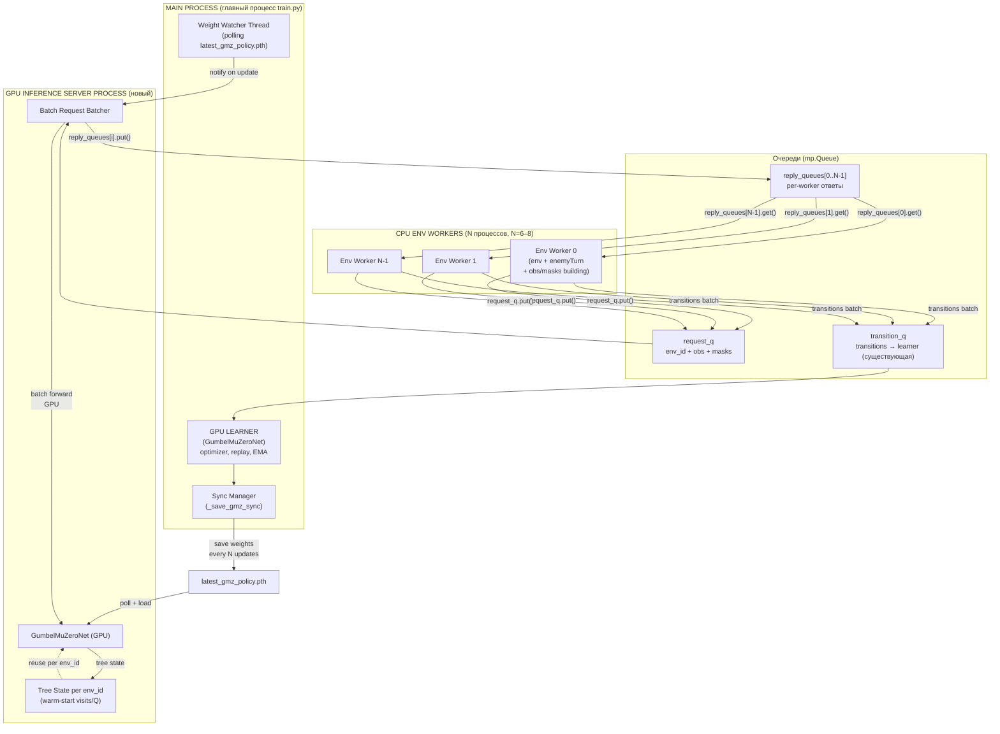

# Вариант B: Inference Server + CPU Env Workers для GMZ

## Executive Summary

Вариант B заменяет N отдельных GPU/CPU actor-процессов (вариант A) на **N CPU env workers** + **1 centralized GPU inference server** + **1 GPU learner**. Инференс сети (MCTS/Gumbel search) выносится из env worker в отдельный процесс на GPU, что позволяет:

1. **Собирать запросы** от N env workers и обрабатывать на одной GPU-копии сети (request batching; cross-env forward — опционально, §4.1)
2. **Переиспользовать tree state** (warm-start visits/Q) между ходами одной игры
3. **Избежать GPU contention** — на GPU одновременно работает ровно 1 inference server + 1 learner
4. **Увеличить parallelism** — env workers на CPU не блокируются на GPU compute

Вариант A оставляем как fallback: `inference_server_enabled=0` → работает как сейчас.

Целевая конфигурация для RTX 5060 Ti 16 GB: **6 CPU env workers + 1 GPU inference server + 1 GPU learner**.

---

## 2. Диаграмма архитектуры



---

## 3. Протокол сообщений

### 3.1. Очередь `request_q` (env worker → inference server)

| Поле | Тип | Описание |
|------|-----|----------|
| `env_id` | `int` | Уникальный ID env worker (0..N-1) |
| `step_in_episode` | `int` | Шаг внутри эпизода (0, 1, 2, …) |
| `episode_id` | `int` | ID эпизода (для tree clear при новом эпизоде) |
| `obs` | `np.ndarray` | Observation (float32, shape `[obs_dim]`) |
| `legal_masks_by_head` | `list[np.ndarray]` | Маски легальности (bool, по головам) |
| `is_new_episode` | `bool` | Если True — сбросить tree state для `env_id` |

**Примечание:** `reply_q` **не** передаётся в каждом сообщении. При spawn main создаёт `reply_queues: list[mp.Queue]` (длина = `num_env_workers`); inference server отвечает в `reply_queues[env_id]`. Надёжнее на Windows spawn (меньше pickle Queue на каждый шаг).

### 3.2. Очередь `response_q` (inference server → env worker)

Per-worker private queue (не глобальная). Структура одного сообщения:

| Поле | Тип | Описание |
|------|-----|----------|
| `env_id` | `int` | ID env worker |
| `selected_actions` | `list[int]` | Выбранные действия (по головам) |
| `policy_targets` | `list[np.ndarray]` | Целевая политика (softmax over Q-values) |
| `behavior_logits` | `list[np.ndarray]` | Pre-softmax логиты (для V-trace) |
| `value_est` | `float` | Оценка value |
| `policy_version` | `int` | Версия весов inference server на момент search (из sync-файла) |

### 3.3. Очередь `transition_q` (env worker → learner, существующая)

Структура rollout как в варианте A, но **обязательно** дополнить полями (сейчас в actor-learner они теряются — см. §6.1):

| Поле в transition dict | Назначение |
|------------------------|------------|
| `behavior_logits` | V-trace IS в learner |
| `legal_masks_by_head` | reanalyze (B2) |
| `policy_version` | из `InferenceResponse` |

### 3.4. Weight Sync (learner → inference server)

| Механизм | Описание |
|----------|----------|
| Файл | `latest_gmz_policy.pth` — пишется learner'ом каждые `GMZ_SYNC_EVERY_UPDATES` |
| Polling | Inference server polling файла с интервалом 0.5s |
| Policy version | Поле `policy_version` в файле — inference server проверяет и обновляет веса |
| Fallback | Если inference server не может загрузить веса (файл занят) — retry через 0.5s |

### 3.5. Backpressure и таймауты

**Первичный механизм (Phase 2):** `request_q = mp.Queue(maxsize=N)` — env worker блокируется на `put`, если inference server не успевает. Логировать depth/size периодически.

**Опционально (Phase 3+):** `{"kind": "pause"}` / `{"kind": "resume"}` в отдельной control-очереди или `transition_q` — только если `maxsize` недостаточно (в текущем GMZ learner такого протокола нет).

| Ситуация | Поведение |
|----------|-----------|
| `reply_queues[env_id].get(timeout)` | Retry 1–2 раза, затем fail episode + `[GMZ][INF_SERVER] timeout env=X` |
| CPU fallback | **Не по умолчанию.** Флаг `inference_cpu_fallback=1` только для dev (иначе 6× net на RAM) |
| Shutdown | Sentinel `None` в `request_q` → inference server выходит из loop |

---

## 4. Сравнение с вариантом A

| Критерий | Вариант A (2 GPU actors) | Вариант B (1 GPU inference server) |
|----------|--------------------------|-------------------------------------|
| **GPU utilization** | ~21% (2 процесса с net на GPU) | **цель 35–60%** (1 net + больше запросов; см. §4.1) |
| **CPU utilization** | ~12% (2 Python процесса) | **50–90%** (4–6 env workers + PPO opponent) |
| **Episodes/h** | baseline | **цель +20–40%** (измерять на железе) |
| **Tree reuse** | Да, per-actor (2 дерева) | **Да, per env_id** на inference server |
| **Batch efficiency** | `batch_recurrent` внутри одного `search.run` | **то же + request batching** (N вызовов `search.run` за collect window); cross-env forward — §4.1 уровень 2b |
| **VRAM** | 2× net + learner + gradients ≈ 600 MB+ | **1× net (IS) + 1× net (learner)** ≈ 400 MB (без копий net per env) |
| **Latency variance** | Низкая (каждый actor 독립ный) | **Выше** (нужен батчинг) |
| **Complexity** | Низкая | **Средняя** (RPC-style IPC) |
| **Tree state persistence** | Да (per actor) | **Да (per env_id в server)** |
| **Opponent (PPO)** | В actor на CPU | **В env worker на CPU (unchanged)** |
| **Fallback** | N/A | **inference_server_enabled=0 → вариант A** |
| **Rollback risk** | Низкий | **Средний** (новая IPC-схема) |

**Когда что использовать:**

| Ситуация | Рекомендация |
|----------|--------------|
| RTX 5060 Ti + хочется максимум throughput | **Вариант B** |
| Debug / development /不稳定ные фичи | **Вариант A** (проще) |
| GPU利用率 < 30% + CPU 100% (вариант A) | **Вариант B** — цель достигнута |
| Batch size inference = 1 (CPU bottleneck) | **Вариант B** — GPU batching решает |
| 8 CPU cores / старый CPU | **Вариант A** или B с `num_env_workers=4` |
| Стабильность / отладка | **Вариант A** (`inference_server_enabled=0`) |

См. также: `docs/gpu-actors-gmz-design.md` (вариант A).

### 4.1. Уровни batching (важно не путать)

| Уровень | Что делает | Где в коде | Phase |
|---------|------------|------------|-------|
| **2a** | `batch_recurrent`: все sims одного хода в одном `recurrent_inference` | `gumbel_muzero_search.py` | Уже есть; IS вызывает `search.run` |
| **2a** | Request batching: собрать до `inference_batch_size` запросов за `inference_batch_interval_ms`, обработать подряд | `gmz_inference_server.py` | Phase 2 |
| **2b** | Cross-env batch: один forward на obs от разных env | Требует рефакторинга search/model | **Вне scope MVP**; отдельная задача |

Цели GPU util и throughput в §8 привязаны к **2a**, не к 2b.

---

## 5. Дизайн Inference Server

### 5.1. API класса

```python
# core/models/gmz_inference_server.py

from dataclasses import dataclass
import threading
from typing import Optional

import numpy as np
import torch
import torch.nn as nn


@dataclass
class InferenceRequest:
    env_id: int
    step_in_episode: int
    episode_id: int
    obs: np.ndarray                      # shape (obs_dim,), float32
    legal_masks_by_head: list[np.ndarray]  # list of bool arrays
    is_new_episode: bool
    # reply_q НЕ в запросе — server пишет в reply_queues[env_id]


@dataclass
class InferenceResponse:
    env_id: int
    selected_actions: list[int]
    policy_targets: list[np.ndarray]     # list of float32 arrays
    behavior_logits: list[np.ndarray]    # list of float32 arrays
    value_est: float
    policy_version: int                  # веса IS на момент search


class GMZInferenceServer:
    """
    Centralized GPU inference server for Gumbel MuZero.

    Receives (obs, masks) from N env workers, batches requests,
    runs GumbelMuZeroSearch.run() per request (tree reuse per env_id),
    returns (actions, policy_targets, value) to each worker.

    Design goals:
    - One network copy on GPU (shared by all GumbelMuZeroSearch instances)
    - Request batching + batch_recurrent inside each search.run
    - Per-env_id tree state for warm-start
    - Non-blocking weight updates via polling
    - CUDA stream for inference/learning overlap
    """

    def __init__(
        self,
        *,
        net: "GumbelMuZeroNet",
        search_config: "GumbelMuZeroSearchConfig",
        device: torch.device,
        request_queue: torch.multiprocessing.Queue,
        reply_queues: list[torch.multiprocessing.Queue],
        sync_path: str,
        sync_check_interval: float = 0.5,
        inference_batch_size: int = 8,
        compile_mode: Optional[str] = "reduce-overhead",
    ):
        self.net = net
        self.search_cfg = search_config
        self.device = device
        self.request_q = request_queue
        self.reply_queues = reply_queues
        self.sync_path = sync_path
        self.sync_check_interval = sync_check_interval
        self.max_batch_size = inference_batch_size

        # Per-env tree state: env_id -> GumbelMuZeroSearch (stateful)
        self._tree_states: dict[int, "GumbelMuZeroSearch"] = {}

        # CUDA stream for inference (overlap with learner)
        self._inference_stream = torch.cuda.Stream() if device.type == "cuda" else None

        # Weight update thread (daemon, polls sync_path)
        self._running = True
        self._weight_version = 0
        self._weight_lock = threading.Lock()
        self._weight_thread = threading.Thread(target=self._poll_weights, daemon=True)
        self._weight_thread.start()

        # Batch accumulator
        self._pending: list[InferenceRequest] = []
        self._pending_lock = threading.Lock()
        self._batch_interval = 0.02  # 20ms max wait for batching

    # ------------------------------------------------------------------
    # Public API
    # ------------------------------------------------------------------

    def run(self) -> None:
        """Main loop: collect batches, forward, respond."""
        while self._running:
            # В _collect: если request_q.get() вернул None — shutdown sentinel
            self._collect_and_process_batch()

    def stop(self) -> None:
        self._running = False
        self._weight_thread.join(timeout=2.0)

    # ------------------------------------------------------------------
    # Weight update via polling
    # ------------------------------------------------------------------

    def _poll_weights(self) -> None:
        """Daemon thread: poll latest_gmz_policy.pth, reload on change."""
        import os
        last_mtime = -1.0
        while self._running:
            try:
                if os.path.isfile(self.sync_path):
                    mtime = os.path.getmtime(self.sync_path)
                    if mtime > last_mtime:
                        payload = torch.load(
                            self.sync_path, map_location="cpu", weights_only=False
                        )
                        sd = payload.get("state_dict") if isinstance(payload, dict) else None
                        if isinstance(sd, dict):
                            with self._weight_lock:
                                self.net.load_state_dict(sd, strict=False)
                                self.net.eval()
                                new_ver = payload.get(
                                    "policy_version", self._weight_version
                                )
                                self._weight_version = int(new_ver)
                                # Все search делят self.net — отдельные net_copy не нужны
                                for search in self._tree_states.values():
                                    search.net = self.net
                            last_mtime = float(mtime)
                            # Опционально: clear_tree при смене version (флаг config)
            except Exception:
                pass  # file busy or corrupted — retry
            import time; time.sleep(self.sync_check_interval)

    # ------------------------------------------------------------------
    # Batch processing
    # ------------------------------------------------------------------

    def _collect_and_process_batch(self) -> None:
        """Collect requests from queue, batch, forward, respond."""
        # Non-blocking collect; req is None → self._running = False (shutdown)
        while len(self._pending) < self.max_batch_size:
            try:
                req = self.request_q.get(timeout=self._batch_interval)
                if req is None:
                    self._running = False
                    return
                with self._pending_lock:
                    self._pending.append(req)
            except Exception:  # queue.Empty
                break
            if len(self._pending) >= self.max_batch_size:
                break

        if not self._pending:
            return

        with self._pending_lock:
            batch = list(self._pending)
            self._pending = []

        self._process_batch(batch)

    def _process_batch(self, batch: list[InferenceRequest]) -> None:
        """Process a batch of requests: tree reuse, forward, respond."""
        import time
        start = time.perf_counter()

        # Group by env_id to handle tree reuse
        by_env: dict[int, list[InferenceRequest]] = {}
        for req in batch:
            by_env.setdefault(req.env_id, []).append(req)

        results: list[tuple[InferenceRequest, InferenceResponse]] = []

        for env_id, env_batch in by_env.items():
            # Tree state for this env
            search = self._get_or_create_tree(env_id)

            for req in env_batch:
                if req.is_new_episode:
                    search.clear_tree_state()

                # Только search.run — внутри уже initial_inference + batch_recurrent
                with torch.no_grad():
                    if self._inference_stream is not None:
                        with torch.cuda.stream(self._inference_stream):
                            policy_targets, behavior_logits, actions, value_est = search.run(
                                obs=req.obs,
                                legal_masks_by_head=req.legal_masks_by_head,
                                deterministic=False,
                            )
                    else:
                        policy_targets, behavior_logits, actions, value_est = search.run(
                            obs=req.obs,
                            legal_masks_by_head=req.legal_masks_by_head,
                            deterministic=False,
                        )

                resp = InferenceResponse(
                    env_id=req.env_id,
                    selected_actions=actions,
                    policy_targets=policy_targets,
                    behavior_logits=behavior_logits,
                    value_est=value_est,
                    policy_version=int(self._weight_version),
                )
                results.append((req, resp))

        # --- Send responses back to workers ---
        for req, resp in results:
            try:
                self.reply_queues[req.env_id].put_nowait(resp)
            except Exception:
                pass  # worker may have died

        elapsed = time.perf_counter() - start
        if elapsed > 0.5:
            import logging
            logging.warning(f"[GMZ][INF_SERVER] Slow batch: {elapsed:.3f}s for {len(batch)} reqs")

    def _get_or_create_tree(self, env_id: int) -> "GumbelMuZeroSearch":
        """Get or create GumbelMuZeroSearch for env_id (shared self.net, no copy)."""
        if env_id not in self._tree_states:
            from core.models.gumbel_muzero_search import GumbelMuZeroSearch
            with self._weight_lock:
                self._tree_states[env_id] = GumbelMuZeroSearch(
                    net=self.net,
                    config=self.search_cfg,
                    device=self.device,
                )
        return self._tree_states[env_id]

    def clear_tree_for_env(self, env_id: int) -> None:
        """Called externally when env worker starts new episode."""
        if env_id in self._tree_states:
            self._tree_states[env_id].clear_tree_state()
```

### 5.2. Pseudocode главного loop (inference server process)

```python
def _gmz_inference_server_entry(
    request_q: mp.Queue,
    reply_queues: list[mp.Queue],
    sync_path: str,
    init_weights: dict,
    search_cfg: dict,
    inference_batch_size: int,
):
    """Entry point for inference server process (Windows spawn compatible)."""
    device = torch.device("cuda" if torch.cuda.is_available() else "cpu")
    net = GumbelMuZeroNet(...).to(device)
    net.load_state_dict(normalize_state_dict(init_weights))
    net.eval()

    if GMZ_INFERENCE_SERVER_COMPILE and device.type == "cuda":
        net = torch.compile(net, mode="reduce-overhead", fullgraph=False)

    search_config = GumbelMuZeroSearchConfig(
        num_simulations=int(search_cfg.get("num_simulations", GMZ_MCTS_SIMS)),
        root_top_k=int(search_cfg.get("root_top_k", GMZ_ROOT_TOP_K)),
        batch_recurrent=True,   # Batching — главная фича варианта B
        tree_reuse=True,        # Warm-start между ходами
        # ...
    )

    server = GMZInferenceServer(
        net=net,
        search_config=search_config,
        device=device,
        request_queue=request_q,
        reply_queues=reply_queues,
        sync_path=sync_path,
        inference_batch_size=inference_batch_size,
    )

    append_agent_log("[GMZ][INF_SERVER] started "
        f"batch={inference_batch_size} device={device.type}")

    try:
        server.run()
    finally:
        server.stop()
```

### 5.3. `GMZInferenceClient` (env worker side)

```python
# core/models/gmz_inference_client.py

class GMZInferenceClient:
    """RPC-обёртка: env worker → request_q → reply_queues[env_id]."""

    def __init__(self, env_id: int, request_q: mp.Queue, reply_q: mp.Queue, timeout: float):
        self.env_id = env_id
        self.request_q = request_q
        self.reply_q = reply_q
        self.timeout = timeout

    def infer(
        self,
        *,
        obs: np.ndarray,
        legal_masks_by_head: list[np.ndarray],
        step_in_episode: int,
        episode_id: int,
        is_new_episode: bool,
    ) -> InferenceResponse:
        self.request_q.put({
            "env_id": self.env_id,
            "obs": obs,
            "legal_masks_by_head": legal_masks_by_head,
            "step_in_episode": step_in_episode,
            "episode_id": episode_id,
            "is_new_episode": is_new_episode,
        })  # dict предпочтительнее dataclass для mp.Queue на Windows
        return self.reply_q.get(timeout=self.timeout)
```

### 5.4. Env worker — рефакторинг selfplay (не копировать цикл в train.py)

**Рекомендуемый путь:** расширить `play_episode_with_gumbel_muzero` параметром `inference_fn` (или объект с `.run()`), чтобы env worker и вариант A делили один код.

```python
# gumbel_muzero_selfplay.py — псевдо
def play_episode_with_gumbel_muzero(..., inference_fn=None, search=None):
    # inference_fn(obs, masks, ...) -> (pi, beh, actions, value)
    # если inference_fn задан — search не используется (вариант B)
    # иначе search.run(...) как сейчас (вариант A)
```

Env worker entry (`_gmz_env_worker_entry`) повторяет **паритет** с `_actor_learner_actor_entry_gumbel_muzero`:

- `roll_off_attacker_defender`, `deploy_for_mission`, `post_deploy_setup`, `attacker_side`/`defender_side`
- `play_episode_with_gumbel_muzero(..., inference_fn=client.infer, ...)`
- `("ep", {...})` метрики в `transition_q` — как у актора
- rollout dict: `state`, `action`, `reward`, `done`, `policy_targets`, **`behavior_logits`**, **`legal_masks_by_head`**, `value_target`, **`policy_version`** (из response)

При timeout: retry → лог → пропуск шага/эпизода (без CPU net по умолчанию).

### 5.5. Shutdown

| Шаг | Действие |
|-----|----------|
| Stop train | Main кладёт `None` в `request_q` |
| Inference server | Выходит из `run()`, `stop()` weight thread |
| Env workers | Получают sentinel на control или завершают по `done` |
| Join | `process.join(timeout=...)` + лог если зависли |

### 5.6. Веса и tree_reuse после sync

| Событие | Поведение |
|---------|-----------|
| `policy_version` вырос | `self.net.load_state_dict`; все `search.net = self.net` |
| Stale warm-start | По умолчанию **не** чистить tree; опция `clear_tree_on_weight_sync=1` |
| `is_new_episode` | Всегда `search.clear_tree_state()` для `env_id` |

**reanalyze** остаётся в learner на replay-buffer — inference server только root search для сбора данных.

---

## 6. Изменения env worker

**Что убираем (по сравнению с `_actor_learner_actor_entry_gumbel_muzero`):**
- ❌ Создание копии `GumbelMuZeroNet`
- ❌ Создание `GumbelMuZeroSearch`
- ❌ Синхронизация весов через `latest_gmz_policy.pth` в worker
- ❌ `torch.compile` на worker

**Что оставляем (паритет с вариантом A):**
- ✅ Env, deploy, roll-off, opponent PPO на CPU
- ✅ `play_episode_with_gumbel_muzero` (через `inference_fn`)
- ✅ Batch-send, `("ep", ...)`, outcome_only для `value_target`

**Новое:**
- ✅ `GMZInferenceClient` → `request_q` / `reply_queues[worker_id]`
- ✅ `is_new_episode` на первом шаге эпизода

### 6.1. Исправление learner pipeline (варианты A и B)

В `train.py` при сборке `GMZTransition` из rollout dict **добавить** (Phase 1, не только B):

- `behavior_logits`
- `legal_masks_by_head`

Иначе V-trace/reanalyze в actor-learner неполные (сейчас поля теряются при `data_q.put`).

### 6.2. Валидация конфига (`train.py`)

| `inference_server_enabled` | `actor_device` | `num_actors` / workers |
|----------------------------|----------------|----------------------|
| `0` | `cuda` или `cpu` | как сейчас (A), `actor_max_cuda` |
| `1` | **`inference_server`** (магическая строка) | `num_env_workers` (4–8), `actor_max_cuda=0` |

При `inference_server_enabled=1` и отсутствии CUDA — fallback на вариант A (`cuda`→cpu) с логом `[GMZ][CONFIG][FALLBACK]`.

---

## 7. VRAM и Scheduling на 5060 Ti 16 GB

### 7.1. VRAM Budget (примерное, для balanced preset)

| Компонент | VRAM | Примечание |
|-----------|------|------------|
| Inference server net | ~150 MB | 1× GumbelMuZeroNet (latent=256, hidden=256) |
| Inference activations | ~30–80 MB | per `search.run` (`batch_recurrent` внутри хода); не cross-env batch |
| Learner net (copy 1) | ~150 MB | Optimizer держит grads |
| Learner grads + optimizer state | ~300–500 MB | AdamW: 2× params |
| Learner batch (bs=128) | ~100–200 MB | activations для forward + backward |
| **Total peak** | **~750 MB–1.1 GB** | С учётом torch.compile |
| **Budget left** | **~14–15 GB** | Запас для heavy preset (latent=512: ×2–3) |

### 7.2. Scheduling: CUDA Streams

```python
# Learner process (train.py)
learner_stream = torch.cuda.Stream()  # learner training
inference_stream = torch.cuda.Stream()  # inference server (separate process, own stream)

# No conflict — inference server и learner РАЗНЫЕ процессы.
# Overlap достигается на уровне OS scheduler GPU, не через shared streams.
# Важно: inference server process делает torch.cuda.set_device() явно.
```

### 7.3. Time-Slicing (если нужен tighter VRAM)

Если VRAM tight и inference server мешает learner:

```python
# Learner train step: отключает inference server на время backward
# (через флаг файл: artifacts/models/inference_server_pause.flag)
# Inference server читает флаг и暂时 не использует GPU.

# Practical: обычно не нужно. Inference server делает только inference (no grads),
# поэтому его VRAM footprint << learner footprint.
```

### 7.4. torch.compile

| Компонент | torch.compile | Обоснование |
|-----------|---------------|-------------|
| Inference server net | ✅ `mode="reduce-overhead"` | Forward-only, ускоряет repetitive inference |
| Learner net | ✅ `mode="reduce-overhead"` (существует) | Training forward + backward; compile на backward сложнее |
| Inference server batch | ✅ — | batching делает compile ценнее |

---

## 8. План по фазам

### Phase 0: Подготовка инфраструктуры

**Цель:** Создать skeleton inference server без функциональности, проверить spawn/queue/IPC на Windows.

**Новые файлы:**
- `core/models/gmz_inference_server.py` — skeleton класса (run loop, queue polling)
- `core/models/gmz_inference_client.py` — helper для env worker (request builder)

**Изменения в существующих:**
- `train.py`: Добавить константы `GMZ_INFERENCE_SERVER_*` и feature flag `inference_server_enabled`
- `train.py`: Создать новый режим запуска `_main_actor_learner_gmz_inference_server`
- `app/gui_qt/gmz_hyperparams_defaults.py`: Добавить поля `inference_server_enabled`, `num_env_workers`, `inference_batch_size`

**Критерий готовности:**
- inference server process спавнится без ошибок
- `request_q` + `reply_queues[N]` создаются и alive
- `[GMZ][INF_SERVER] started` в логах

**Задачи:**
- [ ] Define `GMZ_INFERENCE_SERVER_ENABLED`, `GMZ_NUM_ENV_WORKERS`, `GMZ_INFERENCE_BATCH_SIZE` константы
- [ ] Создать `core/models/gmz_inference_server.py` с пустым `run()` loop
- [ ] Модифицировать `_main_actor_learner_gumbel_muzero` — dispatch по `inference_server_enabled`
- [ ] Добавить новые поля в `gmz_hyperparams_defaults.py` и GUI groups
- [ ] Smoke test: запуск с `inference_server_enabled=0` (вариант A) работает как прежде

---

### Phase 1: MVP — работающий end-to-end, без batching

**Цель:** inference server получает obs от 1 env worker, возвращает actions. Работает без tree reuse, без batch. Главное — убедиться что IPC и логика правильные.

**Новые файлы:**
- Нет новых файлов (Phase 0 skeleton расширяется)

**Изменения:**
- `core/models/gmz_inference_server.py`: реализовать `_process_single_request()` (no batching)
- `train.py`: Создать `_gmz_env_worker_entry()` — env worker с request/reply
- `train.py`: Spawn 1 inference server process + 1 env worker process для MVP
- `train.py`: Learner loop — переключиться на `transition_q` от env workers

**Критерий готовности:**
- 1 env worker + inference server проходит 10+ эпизодов без ошибок
- Transitions валидны (state shape, action shape, policy_targets shape)
- `[GMZ][INF_SERVER] request processed` в логах
- Learner получает transitions и обновляет веса

**Задачи:**
- [ ] Реализовать `_process_single_request()` в inference server
- [ ] Создать `_gmz_env_worker_entry()` — базовая env worker логика
- [ ] Реализовать `InferenceRequest` / `InferenceResponse` dataclasses
- [ ] `reply_queues` при spawn (не `reply_q` в каждом request)
- [ ] Переписать spawn loop: 1 IS + 1 worker + learner
- [ ] Timeout: retry + лог; CPU fallback только при `inference_cpu_fallback=1`
- [ ] **Learner:** `behavior_logits` + `legal_masks_by_head` в `GMZTransition` из rollout (A и B)
- [ ] `policy_version` в `InferenceResponse` и в rollout dict
- [ ] Проверить что `actor_sync/latest_gmz_policy.pth` обновляется learner'ом
- [ ] Проверить что inference server перечитывает веса
- [ ] `play_episode_with_gumbel_muzero(..., inference_fn=...)`

---

### Phase 2: Request batching и Tree Reuse (уровень 2a)

**Цель:** собирать несколько запросов за окно 20ms; tree state per `env_id`; shared `self.net` без копий.

**Изменения:**
- `gmz_inference_server.py`: batch accumulator + `_process_batch()` (только `search.run`, без дубля `initial_inference`)
- `_tree_states[env_id]` → `GumbelMuZeroSearch(net=self.net)`
- `request_q = mp.Queue(maxsize=...)` — backpressure
- `train.py`: spawn `num_env_workers` (6 на 7600X, preset 4 при перегрузе CPU)

**Критерий готовности:**
- 4–6 env workers без ошибок
- `[GMZ][INF_SERVER] batch N reqs in Xms`
- warm-start в логах
- GPU util **измерен** (цель > 30%, не блокер CI)

**Задачи:**
- [ ] Batch accumulator (interval + max size)
- [ ] `reply_queues` при spawn (не в каждом request)
- [ ] `clear_tree_state()` при `is_new_episode`
- [ ] `search.net = self.net` после weight poll
- [ ] Опционально: `clear_tree_on_weight_sync`
- [ ] Cross-env batch (2b) — **не в этой фазе**

---

### Phase 3: Integration, Defaults и Polish

**Цель:** GUI, метрики, smoke на железе; включение B по умолчанию **только после** успешного smoke.

**Изменения:**
- `gmz_hyperparams_defaults.py`, GUI, `docs/gpu-actors-gmz-design.md` (ссылка на B)
- Логирование `[GMZ][INF_SERVER]`

**Preset для 5060 Ti 16 GB (после smoke):**
```json
{
  "inference_server_enabled": 1,
  "num_env_workers": 6,
  "inference_batch_size": 8,
  "actor_device": "inference_server",
  "num_actors": 6,
  "actor_max_cuda": 0,
  "sync_every_updates": 2,
  "inference_timeout": 5.0,
  "inference_batch_interval_ms": 20,
  "inference_cpu_fallback": 0
}
```

**До smoke (Phase 0–2):** `"inference_server_enabled": 0` — вариант A остаётся default.

**Критерий готовности:**
- Стабильные логи batch/ms
- Episodes/h и GPU util **замерены** vs A (цели +20–40%, GPU 35–60% — не hard fail CI)
- `inference_server_enabled=0` → A без регрессии
- GUI поля сохраняются

**Задачи:**
- [ ] Defaults: B preset отдельно, default=0 до валидации
- [ ] GUI: checkbox + spinboxes
- [ ] Smoke 100 ep; сравнение nvidia-smi / ep/h
- [ ] Pause/resume — только если `maxsize` недостаточен
- [ ] Windows IPC test: dict roundtrip через mp.Queue

---

## 9. Риски

| Риск | Вероятность | Последствия | Митигация |
|------|-------------|-------------|-----------|
| **Windows spawn + CUDA** — дочерний процесс не может получить GPU | Средняя | Crash inference server | Явно вызывать `torch.cuda.set_device(0)` в server process; проверять `torch.cuda.is_available()` перед инициализацией |
| **IPC latency** — queue roundtrip добавляет задержку | Средняя | Higher latency per step | Batching компенсирует; reply_q per-worker убирает demux overhead |
| **Timeout deadlock** — env worker блокируется на reply | Низкая | Эпизод не завершается | timeout + retry; лог; без CPU net по умолчанию |
| **Batch deadlock** — inference server не получает запросов | Низкая | 0 throughput | Мониторить request_q size; логировать если пусто > N seconds |
| **Stale tree state** — reuse после смены весов | Средняя | Качество политики | `is_new_episode`; опция `clear_tree_on_weight_sync` |
| **Stale net in search** — net_copy per env (старый дизайн) | — | Устаревшие веса | **Исправлено:** один `self.net`, `search.net = self.net` |
| **VRAM OOM** — inference server + learner не помещаются | Низкая (16 GB) | CUDA OOM | Замерить VRAM до реализации; heavy preset может потребовать reduce batch_size |
| **Weight version mismatch** — inference использует старые веса | Средняя | Policy staleness | version tracking в логах; max staleness check |
| **Opponent inference bottleneck** — PPO на CPU в env worker | Низкая | CPU utilization | PPO inference быстрый; если bottleneck — кешировать результат на 1-2 шага |
| **Rollback complexity** — много нового кода | Средняя | Bugs | Phase 0 → 1 → 2 → 3; каждый phase independently verifiable |
| **Queue contention** — 6 workers пишут в 1 request_q | Низкая | Нет (mp.Queue thread-safe) | `maxsize` на request_q как backpressure; логировать queue size |

---

## 10. Тест-план

### 10.1. Unit тесты (без GPU)

| Тест | Описание | Критерий pass |
|------|----------|---------------|
| `test_inference_server_request_queue` | Проверка что `InferenceRequest` правильно сериализуется через mp.Queue | request успешно put/get из queue |
| `test_inference_server_reply_queue` | Проверка per-worker reply_q | response возвращается нужному worker |
| `test_tree_state_per_env` | Проверка что `_tree_states[env_id]` изолированы | Tree state A ≠ Tree state B для разных env_id |
| `test_new_episode_clears_tree` | Проверка что `is_new_episode=True` сбрасывает tree | `search.clear_tree_state()` вызывается |
| `test_batch_accumulator` | Проверка что batch собирается по interval или size | batch отправляется каждые 20ms или при size=batch_size |
| `test_timeout_retry_log` | Timeout на reply_q | retry/abort + лог, без CPU net если fallback=0 |
| `test_mp_queue_dict_roundtrip` | dict request/response на Windows | put/get без ошибок pickle |
| `test_weight_poll_updates_net` | Проверка что polling перечитывает веса | net weights обновляются при изменении sync_path |
| `test_backpressure_pause_resume` | Проверка pause/resume механизма | transition_q отправляет pause/resume |

### 10.2. Smoke тесты (без GPU)

| Тест | Описание | Критерий pass |
|------|----------|---------------|
| `smoke_no_cuda_inference_server` | Запуск inference server без CUDA (CPU fallback) | process starts, loop runs, request handled |
| `smoke_single_env_worker` | 1 worker + IS на CPU | 10 episodes completes without error |
| `smoke_transitions_valid` | Проверка что transitions имеют правильную структуру | state.shape, action.shape, policy_targets[0].shape валидны |

### 10.3. Integration тесты (с GPU)

| Тест | Описание | Критерий pass |
|------|----------|---------------|
| `integration_6_workers_throughput` | 6 workers + IS на GPU | ep/h ≥ baseline×1.2 (ручной benchmark) |
| `integration_gpu_utilization` | nvidia-smi | замер vs A (цель 35–60%, не gate) |
| `integration_tree_reuse` | Warm-start виден в логах | `"[GMZ][INF_SERVER] warm-start env=N"` |
| `integration_weight_sync` | Learner обновляет веса, IS перечитывает | IS weight_version обновляется каждые 2 updates |
| `integration_rollback_variant_a` | `inference_server_enabled=0` | Вариант A: 2 GPU actors spawn, работают |
| `integration_backpressure` | Queue full → pause → resume | transition_q pause/resume events в логах |

---

## 11. Rollout / Feature Flag

### 11.1. Включение

```python
# train.py
GMZ_INFERENCE_SERVER_ENABLED = str(os.getenv(
    "GMZ_INFERENCE_SERVER", str(GMZ_CFG.get("inference_server_enabled", 0))
)).strip() == "1"
```

### 11.2. Dispatch

```python
# _main_actor_learner_gumbel_muzero()
if GMZ_INFERENCE_SERVER_ENABLED:
    _main_actor_learner_gmz_inference_server(
        roster_config=roster_config,
        totLifeT=totLifeT,
        ...
    )
else:
    # Вариант A (существующий код)
    _main_actor_learner_gumbel_muzero_actor_learner(
        roster_config=roster_config,
        totLifeT=totLifeT,
        ...
    )
```

### 11.3. GUI

В Qt GUI (группа "Акторы и replay"):
- Новое поле `inference_server_enabled` (checkbox)
- Новое поле `num_env_workers` (spinbox, 2–8, default=6)
- Новое поле `inference_batch_size` (spinbox, 1–16, default=8)
- Tooltip: "Inference server: вынести MCTS на GPU. CPU env workers только для env.step. Требуется CUDA."

### 11.4. Hyperparams.json defaults

```json
{
  "inference_server_enabled": 0,
  "num_env_workers": 6,
  "inference_batch_size": 8,
  "inference_timeout": 5.0,
  "inference_batch_interval_ms": 20,
  "inference_cpu_fallback": 0,
  "actor_device": "cuda",
  "actor_max_cuda": 2,
  "num_actors": 2
}
```

Preset `inference_server_5060ti` (включать вручную после smoke):

```json
{
  "inference_server_enabled": 1,
  "actor_device": "inference_server",
  "actor_max_cuda": 0,
  "num_actors": 6,
  "num_env_workers": 6
}
```

### 11.5. Rollback strategy

1. **Feature flag** — `inference_server_enabled=0` → вариант A (не трогает новый код)
2. **Gradual rollout** — Phase 1 → Phase 2 → Phase 3, каждый phase independently verifiable
3. **Smoke test CI** — unit тесты запускаются без GPU; integration тесты требуют GPU
4. **Logs first** — смотреть `[GMZ][INF_SERVER]` перед оценкой throughput

---

## 12. Рекомендация

**Делать.** Обоснование:

1. **GPU utilization ~21% в A** — дисбаланс. Вариант B (2a: request batching + 1 net) — следующий шаг.
2. **Tree reuse** — централизованный tree state в inference server — естественное и Elegant решение, которое сложно сделать в варианте A.
3. **VRAM budget** — на 16 GB budget комфортный: 1× net + batch + learner fit легко.
4. **CPU unused** — 6C/12T CPU Ryzen 7600X используется на ~12% в варианте A. 6 env workers используют CPU полнее без contention с GPU.
5. **Risk manageable** — Phase 0 → 1 → 2 → 3 с feature flag и rollback на вариант A.

**Отложить если:**
- Пользователь хочет стабильность важнее throughput
- CUDA в дочерних процессах на Windows окажется проблематичным (workaround: fallback на CPU IS)

**Трудозатраты:**
- MVP (Phase 0+1): **~2–3 дня** (один разработчик)
- Production-ready (Phase 2+3): **+2–3 дня**
- **Total: ~4–6 дней**

---

## 13. AZ Tree (AlphaZero batch_eval)

Inference server потенциально может использоваться для AlphaZero в будущем (`alpha_zero_mcts.py`). Для MVP API **только GMZ** (`GumbelMuZeroSearch.run`). Обобщение — отдельный дизайн после стабилизации B.

---

## 14. Логирование (маркеры)

Все новые log-строки используют маркер `[GMZ][INF_SERVER]`:

```
[GMZ][INF_SERVER] started batch=8 device=cuda
[GMZ][INF_SERVER] request processed env=X step=Y ms=Z
[GMZ][INF_SERVER] batch N reqs in Xms
[GMZ][INF_SERVER] warm-start env=N (hits=K/q_sums reused)
[GMZ][INF_SERVER] weight_updated version=N
[GMZ][INF_SERVER] weight_poll_error: {exc}
[GMZ][INF_SERVER] timeout env=X retry=N
[GMZ][INF_SERVER] weight_sync clear_tree env=N (optional)
[GMZ][INF_SERVER] batch_full queuing N pending
[GMZ][INF_SERVER] env_worker connected worker=N
[GMZ][INF_SERVER] slow_batch ms=N for N reqs
```

---

*План: train.py, gumbel_muzero_search.py, gumbel_muzero_selfplay.py, gmz_hyperparams_defaults.py, docs/gpu-actors-gmz-design.md. Ревизия: исправлены двойной forward, shared net, уровни batching 2a/2b, reply_queues, learner transitions, defaults inference_server_enabled=0 до smoke.*