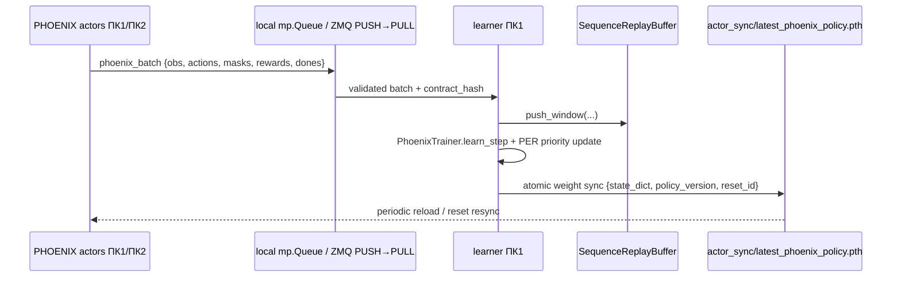

# PHOENIX Wave 2 — Multi-Worker / Distributed Self-Play

**Goal:** добавить для `TRAIN_ALGO=phoenix` actor-learner режим: N CPU-акторов на ПК1 и опциональные LAN-акторы на ПК2 собирают `H+1` sequence windows, learner на ПК1 кладёт их в единый `SequenceReplayBuffer` и делает `PhoenixTrainer.learn_step`.

**Regression rule:** при `PHOENIX_DISTRIBUTED_ACTORS=0` и `phoenix.num_actors=1`/`PHOENIX_NUM_ACTORS=1` остаётся Wave 1 single-process путь.



## Env / Hyperparams

| Hyperparams `phoenix.*` | Env | Default | Decision |
|---|---|---:|---|
| `num_actors` | `PHOENIX_NUM_ACTORS`, fallback `NUM_ACTORS` | `1` | `1` keeps Wave 1; `>1` enables actor-learner |
| `batch_size`, `replay_min_size` | `PHOENIX_BATCH`, `PHOENIX_MIN_REPLAY` | `32`, `256` | current env-only knobs become config |
| `actor_batch_send`, `actor_queue_max` | `PHOENIX_ACTOR_BATCH_SEND`, `PHOENIX_ACTOR_QUEUE_MAX` | `32`, `256` | windows per actor batch and local queue size |
| `sync_every_updates` | `PHOENIX_SYNC_EVERY_UPDATES` | `200` | learner writes `latest_phoenix_policy.pth` |
| `actor_epsilon_mode`, `actor_eps_floor_min/max` | `PHOENIX_ACTOR_EPS_*` | `apex`, `0.02/0.20` | per-actor Ape-X diversity floor |
| `distributed_actors_enabled` | `PHOENIX_DISTRIBUTED_ACTORS` | `0` | PC2 disabled by default |
| `distributed_rollout_port` | `PHOENIX_DIST_ROLLOUT_PORT` | `5562` | no conflict with DQN/AZ/SMZ/GAZ ports |
| `distributed_bind_host`, `distributed_auth_token` | `PHOENIX_DIST_BIND_HOST`, `PHOENIX_DIST_AUTH_TOKEN` | `0.0.0.0`, empty | ZMQ receiver on PC1 |
| `distributed_local_episode_fraction`, `distributed_pc2_num_workers` | `PHOENIX_DIST_LOCAL_EPISODE_FRACTION`, `PHOENIX_DIST_PC2_NUM_WORKERS` | `0.7`, `8` | quota split like DQN |
| `distributed_actors_drain_sec`, `distributed_wait_pc2*`, `distributed_bind_retry_sec` | `PHOENIX_DIST_DRAIN_SEC`, `PHOENIX_DIST_WAIT_PC2*`, `PHOENIX_DIST_BIND_RETRY_SEC` | `30`, `0/600`, `25` | graceful drain and wait-PC2 |
| `dist_zmq_hwm`, `dist_max_windows_per_msg` | `PHOENIX_DIST_ZMQ_HWM`, `PHOENIX_DIST_MAX_WINDOWS_PER_MSG` | `256`, `64` | backpressure and max batch size |
| `ve_latent_bootstrap`, `iqn_kappa` | `PHOENIX_VE_LATENT_BOOTSTRAP`, `PHOENIX_IQN_KAPPA` | `0`, `1.0` | IQN loss ready; latent bootstrap is A/B flag |

Protocol v1 uses a new wire kind `phoenix_batch`. Payload is numpy-only, no torch tensors and no zlib compression: `obs float32 [B,H+1,obs_dim]`, `actions int64 [B,H+1,num_heads]`, `active_masks bool [B,H+1,num_heads]`, `rewards float32 [B,H+1]`, `dones float32 [B,H+1]`, `episode_ids int64 [B]`, `start_steps int64 [B]`, optional `priority float32 [B]`.

## Tasks

- [ ] Config/runtime knobs and GUI defaults.
- [ ] Sequence replay `push_window` + bounded memory.
- [ ] `core/models/phoenix_dist.py`: assembler, stop/context helpers, contract hash, sync helpers.
- [ ] Transport support for `phoenix_batch` through existing AZ/DQN wire layer.
- [ ] Local PHOENIX actor entrypoint and actor-learner learner loop.
- [ ] PC2 launcher and context parity.
- [ ] GUI PHOENIX distributed panel and `_start_training` env wiring.
- [ ] Targeted tests and manual smoke.

## Test Plan

Run targeted PHOENIX/DQN distributed tests:

```powershell
python -m pytest tests/models/test_phoenix_config.py tests/models/test_phoenix_replay.py tests/models/test_phoenix_loss.py tests/models/test_phoenix_trainer.py tests/models/test_phoenix_dist_*.py -q
python -m pytest tests/models/test_dqn_dist_contract_guard.py tests/models/test_dqn_dist_ep_marker.py tests/models/test_dqn_dist_workers.py tests/gui_qt/test_*hyperparams*.py -q
```

Manual smoke:

- GUI → Train → `PHOENIX`, `num_actors=1`, dist off: Wave 1 behavior, logs `[PHOENIX][CONFIG]`, `[PHOENIX][TRAIN]`.
- GUI → `PHOENIX`, `num_actors=8`, dist off, 16-32 ep: logs `[PHOENIX][DIST][ACTOR]`, queue metrics, higher `ep/s`.
- GUI → dist on + wait ПК2: PC1 reaches `waiting_pc2`; PC2 `tools\pc2_phoenix_actors.bat`; see hello, `pc2_ep_accepted`, drain, final snapshot.

## Risks / Rollback / Non-Goals

Risks: memory growth from windows, stale actor weights after reset, PC2 contract mismatch, hidden DQN transport regression. Mitigation: materialized replay capacity, forced sync on reset, hash guard per `phoenix_batch`, DQN dist tests after shared transport edits.

Rollback: set `PHOENIX_NUM_ACTORS=1`, `PHOENIX_DISTRIBUTED_ACTORS=0`. Remote artifacts are isolated: `phoenix_dist_stop.flag`, `phoenix_dist_train_context.json`, `latest_phoenix_policy.pth`, port `5562`.

Non-goals: PHOENIX inference server, MCTS/search, new reward profiles, rewriting DQN distributed, heavy MuZero subset, A/B quality study. Distributed improves wall-clock throughput; sample-efficiency still comes from `replay_ratio` 8-16 and separate WR/draw-rate A/B.
