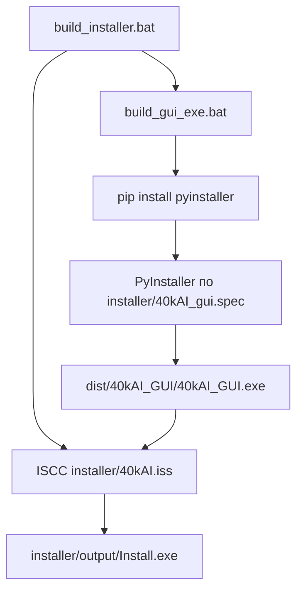

# Подробный гайд: сборка Install.exe и GUI.exe (Windows)

Этот документ для **разработчика**, который собирает установщик. Конечному пользователю нужен только готовый `Install.exe`.

---

## Содержание

1. [Что получится в итоге](#что-получится-в-итоге)
2. [Требования на машине сборки](#требования-на-машине-сборки)
3. [Подготовка окружения (один раз)](#подготовка-окружения-один-раз)
4. [Установка Inno Setup 6](#установка-inno-setup-6)
5. [Сборка Install.exe (полный установщик)](#сборка-installexe-полный-установщик)
6. [Сборка только GUI.exe](#сборка-только-guiexe)
7. [Проверка результата](#проверка-результата)
8. [Что делает Install.exe у пользователя](#что-делает-installexe-у-пользователя)
9. [Частые ошибки](#частые-ошибки)
10. [Структура файлов сборки](#структура-файлов-сборки)

---

## Что получится в итоге

| Артефакт | Путь | Назначение |
|----------|------|------------|
| **Install.exe** | `installer\output\Install.exe` | Установщик для пользователя: копирует приложение, ставит зависимости онлайн, ярлык на рабочий стол |
| **40kAI_GUI.exe** | `dist\40kAI_GUI\40kAI_GUI.exe` | Окно GUI (Qt/QML); train/eval запускаются через `.venv` рядом с установкой |

`build_installer.bat` сначала собирает GUI, потом упаковывает всё в `Install.exe`.

---

## Требования на машине сборки

- **Windows 10/11** (64-bit)
- **Python 3.12+** в PATH (`python --version`)
- **Интернет** (pip при сборке и при установке у пользователя)
- **Inno Setup 6** — только для `Install.exe`, не для одного GUI
- Репозиторий **40kAI** целиком (не только папка `app`)

Рекомендуется: **8+ ГБ RAM**, **10+ ГБ свободного места** на диске (PyInstaller + Qt QML занимают много места в `dist\` и `build\`).

---

## Подготовка окружения (один раз)

Откройте **cmd** или **PowerShell** и перейдите в корень репозитория:

```bat
cd C:\40kAI
```

### Шаг 1. Проверить Python

```bat
python --version
```

Должно быть `Python 3.12.x` или новее. Если команда не найдена — установите с [python.org](https://www.python.org/downloads/) и отметьте **«Add python.exe to PATH»**.

### Шаг 2. Создать виртуальное окружение и зависимости

```bat
installer\install_deps.bat -y
```

Это создаст `.venv` и поставит PySide6, torch и остальное. Сборка GUI использует именно `.venv`, если он есть.

### Шаг 3. (Опционально) Проверить запуск GUI из исходников

```bat
.venv\Scripts\activate
python app\gui_qt\main.py
```

Если GUI открывается — окружение готово к упаковке.

---

## Установка Inno Setup 6

Нужен **только** если собираете `Install.exe`. Для одного `40kAI_GUI.exe` Inno не требуется.

1. Скачайте установщик: [https://jrsoftware.org/isdl.php](https://jrsoftware.org/isdl.php) → **Inno Setup 6**.
2. Установите с настройками по умолчанию.
3. Проверьте, что существует один из путей:
   - `C:\Program Files (x86)\Inno Setup 6\ISCC.exe`
   - `C:\Program Files\Inno Setup 6\ISCC.exe`

Скрипт `build_installer.bat` ищет компилятор автоматически.

---

## Сборка Install.exe (полный установщик)

### Быстрый способ (одна команда)

Из корня репозитория:

```bat
cd C:\40kAI
scripts\build_installer.bat
```

### Что происходит внутри



1. **build_gui_exe.bat** — PyInstaller, папка `dist\40kAI_GUI\` (~сотни МБ, Qt + QML).
2. **ISCC** — Inno Setup читает `installer\40kAI.iss`, кладёт в установщик:
   - `dist\40kAI_GUI\*`
   - `app\`, `core\`, `scripts\`, `train.py`, `eval.py`, …
3. Результат: **`installer\output\Install.exe`**.

Первая полная сборка может занять **5–15 минут** (зависит от диска и CPU).

### Успешный вывод в консоли

```text
[build_gui_exe] Готово: dist\40kAI_GUI\40kAI_GUI.exe
[build_installer] Компиляция installer\40kAI.iss ...
[build_installer] Готово: installer\output\Install.exe
```

### Где лежит готовый файл

```
C:\40kAI\installer\output\Install.exe
```

Этот файл можно отдавать пользователям (флешка, архив, сайт).

---

## Сборка только GUI.exe

Если Inno Setup не установлен или нужен только запускаемый GUI без установщика:

```bat
cd C:\40kAI
scripts\build_gui_exe.bat
```

Запуск (из корня репозитория, нужен `.venv` с зависимостями):

```bat
dist\40kAI_GUI\40kAI_GUI.exe
```

**Важно:** один `40kAI_GUI.exe` без копии `train.py`, `core\`, `.venv` **не сможет** запускать обучение. Для полноценной работы нужна либо установка через `Install.exe`, либо полный каталог репозитория + `install_deps.bat`.

---

## Проверка результата

### После сборки GUI

```bat
dir dist\40kAI_GUI\40kAI_GUI.exe
```

Файл должен существовать. Размер папки `dist\40kAI_GUI\` обычно **сотни МБ** (Qt QML plugins).

### После сборки Install.exe

```bat
dir installer\output\Install.exe
```

### Тест установки (на своей машине)

1. Запустите `installer\output\Install.exe` **от имени администратора** (Inno по умолчанию ставит в Program Files).
2. В мастере включите галочку **«Создать ярлык на рабочем столе»**.
3. Дождитесь окна консоли **updater** (pip, SKIP/UPDATE) — нужен **Python 3.12+ в PATH** на машине, где ставите.
4. В конце отметьте **«Запустить 40kAI»** или откройте:
   - `C:\Program Files\40kAI\40kAI_GUI\40kAI_GUI.exe`
5. Проверьте ярлык на рабочем столе (если галочка была включена).

Лог установки зависимостей:

```text
C:\Program Files\40kAI\runtime\logs\install.log
```

Повторный запуск `install_deps.bat` в каталоге установки должен показать много строк **`[SKIP]`** для уже актуальных пакетов.

---

## Что делает Install.exe у пользователя

1. Копирует файлы в `C:\Program Files\40kAI\` (или выбранный каталог).
2. Запускает `scripts\updater\install_or_update.py`:
   - создаёт `.venv`;
   - ставит/обновляет пакеты из `requirements_windows.txt`;
   - **SKIP** — уже установлено и не устарело;
   - **UPDATE** — установка или обновление;
   - PyTorch: **CUDA** при NVIDIA GPU, иначе **CPU**.
3. По желанию — ярлык на рабочем столе.
4. Предлагает запустить GUI.

**Требования у пользователя:**

- Windows 10/11 x64  
- **Python 3.12+ в PATH** (для шага зависимостей при установке)  
- Интернет (скачивание pip-пакетов, torch может быть очень большим на GPU)

Обновление зависимостей позже:

```bat
"C:\Program Files\40kAI\install_deps.bat" -y
```

---

## Частые ошибки

### `Inno Setup 6 не найден`

**Причина:** не установлен Inno или установлен не в стандартную папку.

**Решение:** установите Inno Setup 6 (см. выше) или соберите только GUI: `scripts\build_gui_exe.bat`.

---

### `Python не найден в PATH`

**Причина:** Python не в PATH при сборке.

**Решение:** переустановите Python с галочкой PATH или используйте полный путь:

```bat
C:\Users\ВАШ_ПОЛЬЗОВАТЕЛЬ\AppData\Local\Programs\Python\Python312\python.exe -m venv .venv
```

---

### PyInstaller падает на PySide6 / QML

**Причина:** нет PySide6 в `.venv` или битая установка.

**Решение:**

```bat
install_deps.bat -y
scripts\build_gui_exe.bat
```

Предупреждение про `qmlassetdownloaderprivateplugin.dll` в логе PyInstaller обычно **не критично**.

---

### У пользователя после Install.exe GUI не запускает train

**Причина:** не завершился updater (нет Python у пользователя, нет сети, ошибка pip).

**Решение:** открыть `runtime\logs\install.log`, вручную запустить `install_deps.bat` в каталоге установки.

---

### `build\` и `dist\` занимают много места

Это нормально. В `.gitignore` уже есть `build/`, `dist/`, `installer/output/`. Для очистки перед пересборкой можно удалить:

```bat
rmdir /s /q build dist
```

---

## Структура файлов сборки

```text
40kAI/
  scripts/
    build_gui_exe.bat       # только GUI
    build_installer.bat     # GUI + Install.exe
    updater/
      install_or_update.py  # SKIP/UPDATE логика
    detect_torch_variant.py
  installer/
    40kAI_gui.spec          # PyInstaller
    40kAI.iss               # Inno Setup
    output/
      Install.exe           # ← готовый установщик
  dist/
    40kAI_GUI/
      40kAI_GUI.exe         # ← готовый GUI
  install_deps.bat          # зависимости (разработка и после установки)
```

---

## Краткая шпаргалка

```bat
REM 1. Один раз: зависимости для сборки
cd C:\40kAI
install_deps.bat -y

REM 2. Установить Inno Setup 6 с jrsoftware.org

REM 3. Полный установщик
scripts\build_installer.bat

REM 4. Готовый файл
installer\output\Install.exe
```

Только GUI без Inno:

```bat
scripts\build_gui_exe.bat
dist\40kAI_GUI\40kAI_GUI.exe
```
