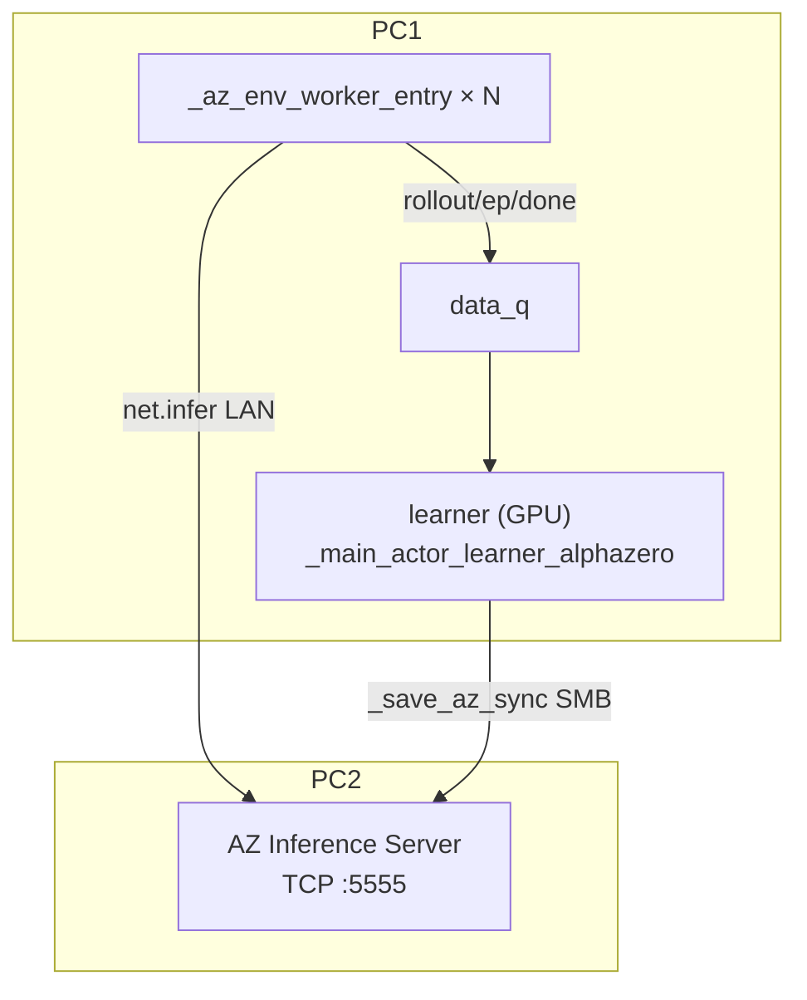
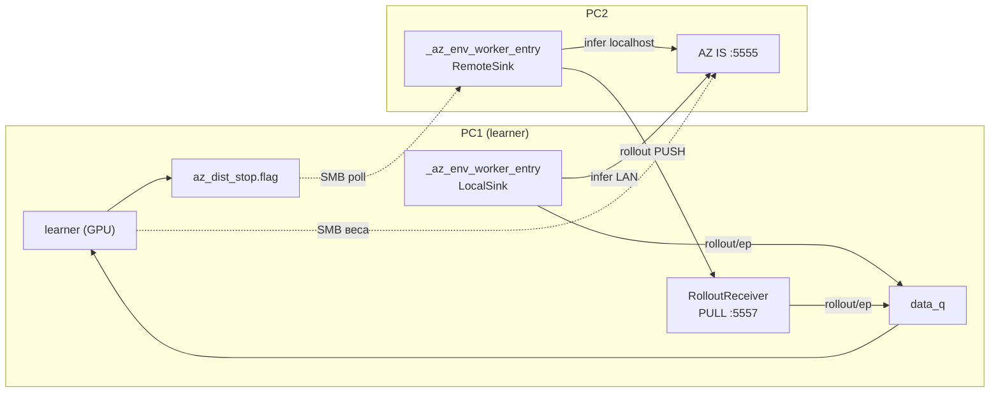

# План: Distributed self-play для AlphaZero TREE (PC1 learner + PC2 actors)

**Статус:** фазы **5.0–5.2** в коде (protocol/sink/receiver, learner, `pc2_az_actors`). GUI-тоггл и docs — 5.3. AZ Inference Server (variant B) **уже в коде** — distributed self-play переиспользует transport/SMB-sync, **не заменяет** IS.
**Scope:** `TRAIN_ALGO=alphazero_tree`. Learner на PC1, env-воркеры на PC1+PC2.
**Целевой деплой:** **IS LAN** — `AZ_INFERENCE_SERVER=1`, `AZ_INFERENCE_SERVER_MODE=remote`, AZ IS на PC2 (`:5555`); self-play-воркеры = `_az_env_worker_entry` (variant B). Distributed self-play **добавляет** канал rollout'ов `:5557`, **не заменяет** IS.
**Родственные планы:** `plans/az-tree-inference-server.md` (переиспользуем транспорт/протокол/SMB-sync).

> Имена функций/файлов сверены с кодом на `main`. Где утверждается поведение — указан файл. В коде есть fallback **variant A** (`_actor_learner_actor_entry_alphazero`, CPU-net без IS) — в плане §6.2; боевой путь — variant B + IS.

---

## 1. Executive Summary

**Цель.** Задействовать CPU второго ПК под self-play: env-воркеры гоняют эпизоды на PC1 **и** PC2, learner остаётся один (на PC1, GPU 5060 Ti). PC2 шлёт rollout'ы по сети (ZMQ), веса получает по SMB.

**Почему это правильный рычаг для AZ tree (в отличие от LAN inference server).** Узкое место AZ tree — **CPU env-rollout'ы** (`env.step` + `enemyTurn`), а не GPU. LAN-IS переносит на PC2 только `net.infer` (не bottleneck) и страдает от per-move round-trip. Distributed self-play добавляет на PC2 ровно то, чего не хватает — **CPU под симуляции**, и при этом:
- **латентность сети не важна** — rollout'ы шлются пачками (`actor_batch_send`) асинхронно, fire-and-forget (нет per-move round-trip);
- **graceful degradation (dist)** — отвал **dist-акторов** на PC2 не роняет train (PC1-воркеры + learner продолжают). **IS на PC2** для variant B по-прежнему критичен для всех `_az_env_worker_entry` — это не лечит distributed self-play;
- **качество не теряется** — это просто больше данных тем же поиском.

**Ожидаемый выигрыш.** PC2 = Ryzen 5 1600 (слабее 7600 по IPC и старше) → реалистично **+40–70% эпизодов/час**, не ×2. Зависит от доли PC2-данных, отбракованных как stale (см. §7).

**Сравнение с текущим (только PC1).**

| | Сейчас | To-Be (distributed) |
|--|--------|---------------------|
| Self-play CPU | только 7600 | 7600 **+ 1600** |
| Learner | PC1 GPU | PC1 GPU (без изменений) |
| `net.infer` | PC1-воркеры → IS PC2 `:5555` | без изменений |
| Источник rollout'ов | локальные → `data_q` | локальные + PC2 (ZMQ `:5557`→`data_q`) |
| Отказ dist на PC2 | — | train + IS LAN на PC1 продолжают |

---

## 2. Scope & Non-goals

**In scope:** `alphazero_tree`, self-play на 2 ПК, learner на PC1. Совместимость с honest DET-eval, actor sync, resume, **IS LAN** (PC1-воркеры → IS на PC2) + distributed actors на PC2 (те же `_az_env_worker_entry`, infer → **localhost** IS на PC2, rollout → PC1). Опционально: IS Local только на PC1 (без dist) или dist + variant A на PC2 без IS (§6.2).

**Non-goals:** распределённый learner (один learner, PC1); `alphazero_proxy` (тривиально добавится — тот же путь); >2 ПК (схема обобщается, но тестим на 2); отказоустойчивый learner.

---

## 3. As-Is vs To-Be

Два worker-entry в коде: **variant B** `_az_env_worker_entry` (IS, `net=None`) — **целевой**; **variant A** `_actor_learner_actor_entry_alphazero` (локальная CPU-сеть) — fallback при `AZ_INFERENCE_SERVER=0`.

### 3.1. As-Is (только PC1, профиль IS LAN)

Сейчас при `AZ_INFERENCE_SERVER_ENABLED` + `mode=remote` на PC1 крутятся env-воркеры variant B; `net.infer` уходит на PC2, rollout/ep — в локальный `data_q`.

### 3.2. To-Be (PC1 + PC2, IS LAN + distributed)

**Два независимых канала:** (1) IS `:5555` — как сейчас; (2) rollout `:5557` — новый fan-in на learner.

- **PC1:** те же `_az_env_worker_entry` + `LocalSink` → `data_q`; infer → **LAN → PC2 IS**.
- **PC2:** доп. воркеры `_az_env_worker_entry` + `RemoteSink` → ZMQ на PC1; infer → **`127.0.0.1:5555`** (тот же IS на PC2, без LAN round-trip). IS-процесс на PC2 **один** (уже поднимается `pc2_remote_az_is.bat`).

---

## 4. API & Protocol

Сериализация — **msgpack + numpy**, переиспользуем `az_inference_protocol._encode_value/_decode_value` (вынести в общий хелпер или новый `core/models/az_rollout_protocol.py`, импортирующий их).

**Паттерн ZMQ — PUSH/PULL** (не DEALER/ROUTER): односторонний fan-in «много воркеров → один learner», ответ не нужен. PC1 = `PULL.bind(tcp://0.0.0.0:5557)`, каждый PC2-воркер = `PUSH.connect`. HWM на обоих концах для backpressure.

### 4.1. Сообщения (worker → learner)

| kind | payload | заметка |
|------|---------|---------|
| `rollout` | `actor_idx`, `policy_version`, `source` (`local`\|`remote`), `transitions: [...]`, `env_contract_hash` | та же схема, что `_az_env_worker_entry` → `data_q`; `source` для `stale_drop %` и логов |
| `ep` | метрики эпизода + `source`, `actor_idx` | как сейчас; после `totLifeT` новые `ep` с `source=remote` не увеличивают счётчик (§5) |
| `done` | `worker_id` | удалённые «done» не блокируют терминацию (см. §5) |
| `hello` | `worker_id`, `env_contract_hash`, `protocol_version` | при коннекте; receiver валидирует контракт |
| (heartbeat) | `worker_id`, `ts` | для детекта «PC2 молчит» |

Поля transition'а — ровно текущая схема rollout dict (`train.py` `_az_env_worker_entry`): `state` (f32), `policy_targets` (list f32 по головам), `value_target` (f32), `policy_version` (int).

### 4.2. Control (learner → PC2)
**SMB stop-flag** (PC2 и так поллит SMB за весами): learner создаёт `artifacts/models/actor_sync/az_dist_stop.flag` при завершении → PC2-воркеры видят и выходят. Проще и надёжнее отдельного ZMQ-control-канала. (Альтернатива — PUB/SUB, но stop-flag достаточно для v1.)

### 4.3. Версионирование/auth
`AZ_DIST_PROTOCOL_VERSION`, опц. `auth_token` (как IS). `env_contract_hash` обязателен — несовпадение ростера/контракта PC1↔PC2 → receiver дропает rollout + RU-лог `[AZ][DIST] контракт PC2 не совпал…`.

---

## 5. Интеграция в learner (минимальный diff)

**Ключ: `RolloutReceiver` кладёт сообщения в ТОТ ЖЕ `data_q`.** Learner-loop (`while … : kind,payload = data_q.get()`) не меняется — ему всё равно, локальный воркер прислал rollout или PC2.

- `RolloutReceiver` — daemon-поток на PC1: `msg = decode(pull.recv()); validate(msg); data_q.put((msg["kind"], msg["payload"]))`.
- Спавнится в `_main_actor_learner_alphazero` при `AZ_DISTRIBUTED_ACTORS=1`.

**Терминация (детально).** Сейчас: `while done_actors < active_actors` (active = число локальных procs, `train.py:8866`), `episodes_finished += 1` на каждый ep **без cap** (`:8894`). С удалёнными open-ended воркерами это (а) не завершится по `done_actors` и (б) может намерить `> totLifeT` эпизодов. **Решение:**
1. завершать по `episodes_finished >= totLifeT` (а не по `done_actors`);
2. **после достижения totLifeT** — перестать учитывать новые `ep` (cap счётчика/метрик), чтобы не было лишних эпизодов и работы;
3. записать `stop.flag` (SMB) → PC2 выходит;
4. дать `RolloutReceiver` **дренировать** остаток (короткий таймаут): **rollout'ы ещё кладём в replay** (уже сгенерированные переходы не выбрасываем), новые `ep` после cap — игнорируем;
5. затем `join` локальных procs + receiver-поток.
Локальные «done» учитываем как раньше (чтобы не висеть, если локальные кончились раньше плана). PC2-воркеры — **open-ended** до `stop.flag` (§13).

**RolloutSink в воркере** (абстракция, как `Evaluator` для IS). ⚠️ **Два worker-entry на PC1**, sink нужен в ОБА (или вынести общий helper эмиссии rollout/ep/done):
- `_actor_learner_actor_entry_alphazero` (`train.py:8049`) — variant A, **локальная CPU-сеть** + SMB-sync;
- `_az_env_worker_entry` (`:8272`) — variant B (IS), `net=None` + `RemoteEvaluator`.
Иначе при `AZ_DISTRIBUTED_ACTORS=1` + IS Local на PC1 локальные IS-воркеры останутся без sink.
- `LocalSink(data_q)` → `data_q.put(msg)` (текущее поведение, zero-diff).
- `RemoteSink(zmq_push, auth)` → `push.send(encode(msg))`.

---

## 6. PC2: лаунчер и окружение

**Предпосылка:** на PC2 уже запущен AZ IS (`tools/pc2_remote_az_is.bat`, порт **5555**). Distributed-лаунчер **не подменяет** IS, а добавляет env-воркеры.

### 6.1. Основной путь (IS LAN — целевой)

- **Entry на PC2:** `_az_env_worker_entry` + `RemoteSink` (rollout → PC1) + `RemoteEvaluator` → **`127.0.0.1:5555`** (localhost к тому же IS). Веса политики IS подтягивает learner по SMB (`latest_az_tree_policy.pth`) — как сейчас.
- `tools/pc2_az_actors.py` — N процессов `_az_env_worker_entry` с `inference_server_mode=remote`, `remote_host=127.0.0.1`, `remote_port=5555`, `sink=RemoteSink`, `rollout_host=<PC1 LAN IP>`, `rollout_port=5557`.
- **Не делать:** PC2-воркеры с infer обратно на PC1 по LAN — лишний RTT; IS уже на PC2.
- **Опонент:** `OPPONENT_AGENT_ID` + загрузка из SMB-реестра (`artifacts/models/agents`), как train (`load_agent_opponent`), **не pickle `opponent_spec`**.
- **Ростер/контракт:** `tools/write_az_remote_search_cfg.py` → `search_cfg.json` на SMB; PC2 читает obs_dim/action_sizes/контракт.
- **PC2 нужен:** репозиторий + env + `search_cfg.json` + агент-опонент по SMB (тяжелее, чем «только IS», но env-rollout на CPU PC2).
- **Seeds:** `worker_id` с оффсетом (напр. 100+), в rollout/ep `source=remote`.
- **Порядок запуска:** 1) IS на PC2, 2) train на PC1 (IS LAN + `AZ_DISTRIBUTED_ACTORS=1`), 3) `pc2_az_actors.bat`.

### 6.2. Fallback (без IS на PC2)

Если IS на PC2 недоступен, но нужны только dist-акторы: `_actor_learner_actor_entry_alphazero` + `RemoteSink` + SMB-sync весов (`latest_az_tree_policy.pth`). Своя CPU-сеть в процессе (net не bottleneck). Отдельный smoke, не смешивать с §6.1 в одном прогоне.

---

## 7. Staleness — критический нюанс качества

PC2 читает веса по SMB с задержкой (poll-интервал + сетевой лаг) → его rollout'ы **более off-policy**, чем локальные PC1.

- У AZ уже есть guard: `train_alphazero_step` дропает переходы с `policy_version < current - max_policy_staleness_updates` (`alphazero_trainer.py`).
- Риск: при редком SMB-sync / быстром learner много PC2-данных **отбракуется как stale** → выигрыш съест.
- **Рычаги:** (1) чаще sync на PC2 (`ACTOR_SYNC_CHECK_EVERY_EP` меньше), (2) поднять `max_policy_staleness_updates` для distributed, (3) логировать % дропнутых PC2-переходов.
- **Замерять обязательно:** `[AZ][DIST] stale_drop remote=X%` (по `source=remote` в rollout / policy_version при push в replay). Если высоко — крутить (1)/(2).

---

## 8. Changes by File

| Файл | Изменение | Приоритет |
|------|-----------|-----------|
| `core/models/az_rollout_protocol.py` (нов.) | msgpack/numpy encode/decode rollout/ep/done/hello + `AZ_DIST_PROTOCOL_VERSION` (реюз `_encode_value`) | **P0** |
| `core/models/az_rollout_sink.py` (нов.) | `RolloutSink` proto + `LocalSink` (data_q) + `RemoteSink` (ZMQ PUSH) | **P0** |
| `train.py` `_az_env_worker_entry` **и** `_actor_learner_actor_entry_alphazero` | принять `sink=`; все `data_q.put` → `sink.put` в ОБОИХ (или общий helper); zero-diff при LocalSink | **P0** |
| `train.py` `_main_actor_learner_alphazero` | флаг `AZ_DISTRIBUTED_ACTORS`; спавн `RolloutReceiver`; терминация по эпизодам + cap после totLifeT + drain; запись `stop.flag` | **P0** |
| `core/models/az_rollout_receiver.py` (нов.) | ZMQ PULL → `data_q`, валидация контракта, heartbeat-лог | **P0** |
| `tools/pc2_az_actors.py` (нов.) | лаунчер PC2: N `_az_env_worker_entry` (localhost IS) + RemoteSink + опонент по SMB | **P1** |
| `tools/pc2_az_actors.bat` + `runtime/state/pc2_az_actors_config.example.bat` (нов.) | одна кнопка PC2 | **P1** |
| `app/gui_qt/*` | тоггл «Distributed actors (PC2)» + host/port (опц., вкладка AZ Tree) | **P2** |
| `tests/engine/test_az_rollout_protocol.py` (нов.) | encode/decode roundtrip rollout-сообщений | **P0** |
| `tests/engine/test_az_rollout_receiver.py` (нов.) | localhost PUSH→PULL→data_q | **P1** |
| `docs/distributed-selfplay-az.md` + `docs/pc2-az-actors-setup-guide.md` (нов.) | дизайн + LAN-гайд | **P2** |
| `AGENTS.md` | секция Distributed self-play | **P2** |

---

## 9. Phased Implementation

- **5.0** — `az_rollout_protocol` + `RolloutSink` (Local/Remote) + рефактор **обоих** entry (`_az_env_worker_entry` и `_actor_learner_actor_entry_alphazero`, общий helper эмиссии). Unit-тесты. **Zero-diff** при LocalSink.
- **5.1** — `RolloutReceiver` + `AZ_DISTRIBUTED_ACTORS` + терминация/cap/drain + `stop.flag`. **Localhost-smoke:** dist-sink на 127.0.0.1:5557 при обычном IS LAN train.
- **5.2** — `pc2_az_actors.py` + `.bat` (§6.1: env workers + localhost IS). **LAN-smoke:** IS уже на PC2 + dist actors; ep/h и `stale_drop remote %`.
- **5.3** — heartbeat/reconnect, seeds-оффсет, GUI-тоггл, docs, тюнинг staleness.

Для каждой фазы: критерий готовности + smoke + лог-маркеры (`[AZ][DIST][RECEIVER]`, `[AZ][DIST][SINK]`, `[AZ][DIST] stale_drop`).

---

## 10. Testing

- **Unit:** protocol roundtrip (rollout с list-of-np policy_targets, разные головы); `LocalSink` == текущее поведение (zero-diff).
- **Integration:** localhost PUSH→PULL→data_q→learner получает rollout; контракт-mismatch дропается.
- **Regression:** honest DET-eval (на learner, не задет); actor sync; resume; одиночный PC1 (`AZ_DISTRIBUTED_ACTORS=0`) без регрессии.
- **Perf/LAN:** ep/h PC1 vs PC1+PC2; `stale_drop %` от PC2; устойчивость к отвалу PC2 (train продолжается).

---

## 11. Risks & Mitigations

| Риск | Митигация |
|------|-----------|
| Рассинхрон ростера/опонента/контракта PC2 | `env_contract_hash` в каждом rollout; дроп + RU-лог; общий `search_cfg` + агенты по SMB |
| Staleness PC2-данных (SMB-лаг) | чаще sync на PC2, тюнить `max_policy_staleness_updates`, мерить `stale_drop %` |
| Backpressure (PC2 льёт быстрее) | ZMQ HWM + bounded `data_q`; learner быстрее self-play → риск низкий |
| Отвал PC2 / сеть | graceful (PC1 продолжает); heartbeat-лог; reconnect на PC2 |
| Дубли/порядок | `worker_id+episode_id+seq`; PUSH/PULL не теряет (блок при HWM) |
| Терминация (удалённые «done») | завершать по `episodes_finished` + cap после totLifeT; не по `done_actors` |
| Windows spawn pickling | top-level entry; dict-сообщения, не dataclass; **опонент по `OPPONENT_AGENT_ID`**, не pickle `opponent_spec` |
| Переполнение `data_q` (быстрый PC2, медленный learner) | bounded `data_q` + ZMQ HWM; drop-policy с warn-логом `[AZ][DIST] queue_full` |
| Auth на PUSH (LAN) | тот же `auth_token`, что у IS; иначе любой в LAN шлёт rollout'ы |
| Совмещение с IS | **Штатно:** IS LAN + dist (§3.2). PC2 infer → localhost IS. **Не штатно:** PC2 dist + infer на PC1 по LAN; variant A на PC2 без IS (§6.2) — отдельный smoke |
| Firewall/порт 5557 | правило в `pc2_az_actors.bat` |
| Rollback | `AZ_DISTRIBUTED_ACTORS=0` → текущий одиночный путь |

---

## 12. Estimates (один разработчик)

| Фаза | Дни |
|------|-----|
| 5.0 протокол + sink + рефактор | 1 |
| 5.1 receiver + терминация + localhost | 1–1.5 |
| 5.2 PC2 лаунчер + LAN + опонент/ростер sync | 1.5–2 |
| 5.3 robustness + GUI + docs + тюнинг | 1 |
| **Итого** | **~4–5** (MVP localhost 5.0+5.1 ≈ 2) |

Основная возня — не транспорт (его много готового), а **синхронизация env/ростера/опонента на PC2** и **тюнинг staleness**.

---

## 13. Решения и open questions

### Решено

1. **Терминация** — по `episodes_finished >= totLifeT`, cap новых `ep`, drain rollout'ов в replay (§5).
2. **PC2** — open-ended до `stop.flag`; PC1 делит `remaining_episodes` между локальными воркерами.
3. **Опонент/ростер** — SMB: `artifacts/models/agents` + `search_cfg.json` (`write_az_remote_search_cfg.py`).
4. **Сеть PC2 (IS LAN):** `_az_env_worker_entry` + infer **localhost → IS :5555** + `RemoteSink` → PC1. Fallback без IS: variant A (§6.2).
5. **Совмещение dist + IS** — штатный профиль §3.2 (IS не выключаем).

### Open (до/во время реализации)

1. **Staleness:** поднимать `max_policy_staleness_updates` или чаще sync IS/политики на PC2? Замер `stale_drop remote %` после 5.2.
2. **Порт** 5557 (IS = 5555) — ок?
3. **GUI:** тоггл «Distributed actors» или только env/bat в v1?

---

## Recommended approach

`RolloutSink` + `RolloutReceiver` → тот же `data_q`; learner-loop без смены семантики. **Целевой стек:** train на PC1 с **IS LAN** (`_az_env_worker_entry` → PC2 IS) + на PC2 доп. `_az_env_worker_entry` с **localhost IS** и **RemoteSink** (rollout ZMQ :5557). Два канала: infer (5555) и rollout (5557). Веса политики и `stop.flag` — SMB. Завершение по эпизодам + drain. Отказ dist-акторов на PC2 не роняет train (PC1 + IS LAN продолжают); отказ IS по-прежнему критичен для variant B — это отдельно от distributed self-play.

## Top 3 risks
1. **Staleness PC2-данных** (SMB-лаг → отбраковка как off-policy) — может съесть выигрыш; тюнить sync-интервал / `max_policy_staleness_updates`, обязательно мерить `stale_drop %`.
2. **Синхронизация env/ростера/опонента на PC2** — рассинхрон даёт битые данные; защита через `env_contract_hash` + общий `search_cfg`/агенты по SMB.
3. **Терминация и backpressure** — перейти на завершение по эпизодам (не `done_actors`) и поставить ZMQ HWM, иначе зависание/переполнение.
