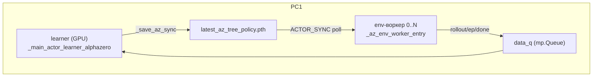
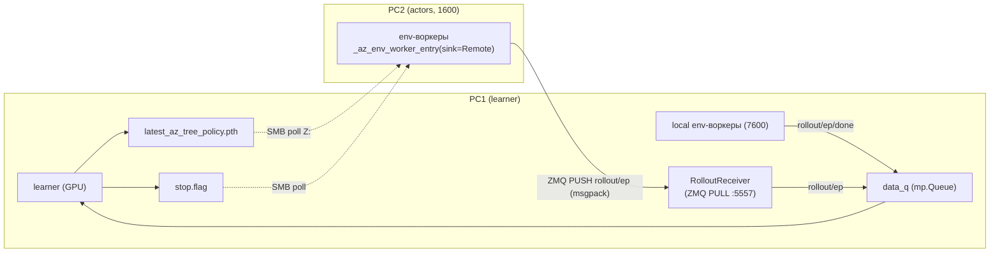

# План: Distributed self-play для AlphaZero TREE (PC1 learner + PC2 actors)

**Статус:** черновик дизайна (код не написан).
**Scope:** `TRAIN_ALGO=alphazero_tree`. Learner на PC1, env-воркеры на PC1+PC2.
**Родственные планы:** `plans/az-tree-inference-server.md` (переиспользуем транспорт/протокол/SMB-sync).

> Имена функций/файлов сверены с кодом на `main`. Где утверждается поведение — указан файл.

---

## 1. Executive Summary

**Цель.** Задействовать CPU второго ПК под self-play: env-воркеры гоняют эпизоды на PC1 **и** PC2, learner остаётся один (на PC1, GPU 5060 Ti). PC2 шлёт rollout'ы по сети (ZMQ), веса получает по SMB.

**Почему это правильный рычаг для AZ tree (в отличие от LAN inference server).** Узкое место AZ tree — **CPU env-rollout'ы** (`env.step` + `enemyTurn`), а не GPU. LAN-IS переносит на PC2 только `net.infer` (не bottleneck) и страдает от per-move round-trip. Distributed self-play добавляет на PC2 ровно то, чего не хватает — **CPU под симуляции**, и при этом:
- **латентность сети не важна** — rollout'ы шлются пачками (`actor_batch_send`) асинхронно, fire-and-forget (нет per-move round-trip);
- **graceful degradation** — отвал PC2 не роняет train, PC1 продолжает локально (у LAN-IS наоборот — IS критичен);
- **качество не теряется** — это просто больше данных тем же поиском.

**Ожидаемый выигрыш.** PC2 = Ryzen 5 1600 (слабее 7600 по IPC и старше) → реалистично **+40–70% эпизодов/час**, не ×2. Зависит от доли PC2-данных, отбракованных как stale (см. §7).

**Сравнение с текущим (только PC1).**

| | Сейчас | To-Be (distributed) |
|--|--------|---------------------|
| Self-play CPU | только 7600 | 7600 **+ 1600** |
| Learner | PC1 GPU | PC1 GPU (без изменений) |
| Источник rollout'ов | локальные процессы → `data_q` | локальные + PC2 (ZMQ→`data_q`) |
| Отказ PC2 | — | train продолжается на PC1 |

---

## 2. Scope & Non-goals

**In scope:** `alphazero_tree`, self-play на 2 ПК, learner на PC1. Совместимость с honest DET-eval, actor sync, resume, IS Local на PC1 (можно совмещать: PC1 = IS Local + воркеры, PC2 = воркеры со своей сетью или своим IS — см. open Q).

**Non-goals:** распределённый learner (один learner, PC1); `alphazero_proxy` (тривиально добавится — тот же путь); >2 ПК (схема обобщается, но тестим на 2); отказоустойчивый learner.

---

## 3. As-Is vs To-Be

### 3.1. As-Is (только PC1)

### 3.2. To-Be (PC1 + PC2)

---

## 4. API & Protocol

Сериализация — **msgpack + numpy**, переиспользуем `az_inference_protocol._encode_value/_decode_value` (вынести в общий хелпер или новый `core/models/az_rollout_protocol.py`, импортирующий их).

**Паттерн ZMQ — PUSH/PULL** (не DEALER/ROUTER): односторонний fan-in «много воркеров → один learner», ответ не нужен. PC1 = `PULL.bind(tcp://0.0.0.0:5557)`, каждый PC2-воркер = `PUSH.connect`. HWM на обоих концах для backpressure.

### 4.1. Сообщения (worker → learner)

| kind | payload | заметка |
|------|---------|---------|
| `rollout` | `actor_idx`, `policy_version`, `transitions: [{state, policy_targets[], value_target, policy_version}]`, `env_contract_hash` | то же, что кладёт `_az_env_worker_entry` в `data_q` сейчас |
| `ep` | метрики эпизода (result/vp_diff/turn/…) | как сейчас |
| `done` | `worker_id` | удалённые «done» не блокируют терминацию (см. §5) |
| `hello` | `worker_id`, `env_contract_hash`, `protocol_version` | при коннекте; receiver валидирует контракт |
| (heartbeat) | `worker_id`, `ts` | для детекта «PC2 молчит» |

Поля transition'а — ровно текущая схема rollout dict (`train.py` `_az_env_worker_entry`): `state` (f32), `policy_targets` (list f32 по головам), `value_target` (f32), `policy_version` (int).

### 4.2. Control (learner → PC2)
**SMB stop-flag** (PC2 и так поллит SMB за весами): learner создаёт `artifacts/models/actor_sync/az_dist_stop.flag` при завершении → PC2-воркеры видят и выходят. Проще и надёжнее отдельного ZMQ-control-канала. (Альтернатива — PUB/SUB, но stop-flag достаточно для v1.)

### 4.3. Версионирование/auth
`AZ_DIST_PROTOCOL_VERSION`, опц. `auth_token` (как IS). `env_contract_hash` обязателен — несовпадение ростера/контракта PC1↔PC2 → receiver дропает rollout + RU-лог `[AZ][DIST] контракт PC2 не совпал…`.

---

## 5. Интеграция в learner (минимальный diff)

**Ключ: `RolloutReceiver` кладёт сообщения в ТОТ ЖЕ `data_q`.** Learner-loop (`while … : kind,payload = data_q.get()`) не меняется — ему всё равно, локальный воркер прислал rollout или PC2.

- `RolloutReceiver` — daemon-поток на PC1: `msg = decode(pull.recv()); validate(msg); data_q.put((msg["kind"], msg["payload"]))`.
- Спавнится в `_main_actor_learner_alphazero` при `AZ_DISTRIBUTED_ACTORS=1`.

**Терминация.** Сейчас: `while done_actors < active_actors` (active = число локальных procs). С удалёнными воркерами ломается. **Решение:** терминировать по эпизодам — `episodes_finished >= totLifeT` (learner уже считает `episodes_finished`). Локальные «done» учитываем как раньше (чтобы не висеть, если локальные кончились раньше плана), но завершаем по счётчику. На завершении — записать `stop.flag`, дать receiver'у дренировать остаток, затем join.

**RolloutSink в воркере** (абстракция, как `Evaluator` для IS):
- `LocalSink(data_q)` → `data_q.put(msg)` (текущее поведение, zero-diff).
- `RemoteSink(zmq_push, auth)` → `push.send(encode(msg))`.
`_az_env_worker_entry` принимает `sink=`; вся отправка rollout/ep/done идёт через `sink.put(...)`.

---

## 6. PC2: лаунчер и окружение

- `tools/pc2_az_actors.py` — спавнит N `_az_env_worker_entry` с `RemoteSink`, читает веса по SMB (`AZ_DIST_WEIGHTS_PATH=Z:\latest_az_tree_policy.pth`), опонент из реестра по SMB.
- `tools/pc2_az_actors.bat` + `runtime/state/pc2_az_actors_config.example.bat` — одна кнопка (deps, firewall :5557, запуск), как `pc2_remote_az_is.bat`.
- **PC2 нужен весь env + ростер + опонент** (в отличие от IS, где нужна только сеть): репозиторий + `search_cfg.json` (ростер/контракт) по SMB + агент-опонент (`artifacts/models/agents` расшарить или скопировать).
- Seeds: PC2-воркерам оффсет `worker_id` (напр. 100+), иначе совпадут траектории с PC1.

---

## 7. Staleness — критический нюанс качества

PC2 читает веса по SMB с задержкой (poll-интервал + сетевой лаг) → его rollout'ы **более off-policy**, чем локальные PC1.

- У AZ уже есть guard: `train_alphazero_step` дропает переходы с `policy_version < current - max_policy_staleness_updates` (`alphazero_trainer.py`).
- Риск: при редком SMB-sync / быстром learner много PC2-данных **отбракуется как stale** → выигрыш съест.
- **Рычаги:** (1) чаще sync на PC2 (`ACTOR_SYNC_CHECK_EVERY_EP` меньше), (2) поднять `max_policy_staleness_updates` для distributed, (3) логировать % дропнутых PC2-переходов.
- **Замерять обязательно:** `[AZ][DIST] stale_drop pc2=X%`. Если высоко — крутить (1)/(2).

---

## 8. Changes by File

| Файл | Изменение | Приоритет |
|------|-----------|-----------|
| `core/models/az_rollout_protocol.py` (нов.) | msgpack/numpy encode/decode rollout/ep/done/hello + `AZ_DIST_PROTOCOL_VERSION` (реюз `_encode_value`) | **P0** |
| `core/models/az_rollout_sink.py` (нов.) | `RolloutSink` proto + `LocalSink` (data_q) + `RemoteSink` (ZMQ PUSH) | **P0** |
| `train.py` `_az_env_worker_entry` | принять `sink=`; все `data_q.put` → `sink.put` (zero-diff при LocalSink) | **P0** |
| `train.py` `_main_actor_learner_alphazero` | флаг `AZ_DISTRIBUTED_ACTORS`; спавн `RolloutReceiver`; терминация по эпизодам; запись `stop.flag` | **P0** |
| `core/models/az_rollout_receiver.py` (нов.) | ZMQ PULL → `data_q`, валидация контракта, heartbeat-лог | **P0** |
| `tools/pc2_az_actors.py` (нов.) | лаунчер PC2: N воркеров + RemoteSink + SMB-веса + опонент | **P1** |
| `tools/pc2_az_actors.bat` + `runtime/state/pc2_az_actors_config.example.bat` (нов.) | одна кнопка PC2 | **P1** |
| `app/gui_qt/*` | тоггл «Distributed actors (PC2)» + host/port (опц., вкладка AZ Tree) | **P2** |
| `tests/engine/test_az_rollout_protocol.py` (нов.) | encode/decode roundtrip rollout-сообщений | **P0** |
| `tests/engine/test_az_rollout_receiver.py` (нов.) | localhost PUSH→PULL→data_q | **P1** |
| `docs/distributed-selfplay-az.md` + `docs/pc2-az-actors-setup-guide.md` (нов.) | дизайн + LAN-гайд | **P2** |
| `AGENTS.md` | секция Distributed self-play | **P2** |

---

## 9. Phased Implementation

- **5.0** — `az_rollout_protocol` + `RolloutSink` (Local/Remote) + рефактор `_az_env_worker_entry(sink=)`. Unit-тесты сериализации. **Zero-diff** при LocalSink (все текущие тесты зелёные).
- **5.1** — `RolloutReceiver` на PC1 + флаг `AZ_DISTRIBUTED_ACTORS` + терминация по эпизодам + `stop.flag`. **Localhost-smoke** (PC1 шлёт сам себе через 127.0.0.1, learner получает данные от «удалённого» воркера).
- **5.2** — `pc2_az_actors.py` + `.bat` + SMB-веса + опонент. **LAN-smoke** на реальном PC2; замер ep/h vs только-PC1 и `stale_drop %`.
- **5.3** — heartbeat/reconnect, seeds-оффсет, GUI-тоггл, docs, тюнинг staleness.

Для каждой фазы: критерий готовности + smoke + лог-маркеры (`[AZ][DIST][RECEIVER]`, `[AZ][DIST][SINK]`, `[AZ][DIST] stale_drop`).

---

## 10. Testing

- **Unit:** protocol roundtrip (rollout с list-of-np policy_targets, разные головы); `LocalSink` == текущее поведение (zero-diff).
- **Integration:** localhost PUSH→PULL→data_q→learner получает rollout; контракт-mismatch дропается.
- **Regression:** honest DET-eval (на learner, не задет); actor sync; resume; одиночный PC1 (`AZ_DISTRIBUTED_ACTORS=0`) без регрессии.
- **Perf/LAN:** ep/h PC1 vs PC1+PC2; `stale_drop %` от PC2; устойчивость к отвалу PC2 (train продолжается).

---

## 11. Risks & Mitigations

| Риск | Митигация |
|------|-----------|
| Рассинхрон ростера/опонента/контракта PC2 | `env_contract_hash` в каждом rollout; дроп + RU-лог; общий `search_cfg` + агенты по SMB |
| Staleness PC2-данных (SMB-лаг) | чаще sync на PC2, тюнить `max_policy_staleness_updates`, мерить `stale_drop %` |
| Backpressure (PC2 льёт быстрее) | ZMQ HWM + bounded `data_q`; learner быстрее self-play → риск низкий |
| Отвал PC2 / сеть | graceful (PC1 продолжает); heartbeat-лог; reconnect на PC2 |
| Дубли/порядок | `worker_id+episode_id+seq`; PUSH/PULL не теряет (блок при HWM) |
| Терминация (удалённые «done») | завершать по `episodes_finished`, не по `done_actors` |
| Windows spawn pickling | top-level entry; dict-сообщения, не dataclass |
| Firewall/порт 5557 | правило в `pc2_az_actors.bat` |
| Rollback | `AZ_DISTRIBUTED_ACTORS=0` → текущий одиночный путь |

---

## 12. Estimates (один разработчик)

| Фаза | Дни |
|------|-----|
| 5.0 протокол + sink + рефактор | 1 |
| 5.1 receiver + терминация + localhost | 1–1.5 |
| 5.2 PC2 лаунчер + LAN + опонент/ростер sync | 1.5–2 |
| 5.3 robustness + GUI + docs + тюнинг | 1 |
| **Итого** | **~4–5** (MVP localhost 5.0+5.1 ≈ 2) |

Основная возня — не транспорт (его много готового), а **синхронизация env/ростера/опонента на PC2** и **тюнинг staleness**.

---

## 13. Open Questions (решить до кода)

1. **Терминация по `episodes_finished`** вместо `done_actors` — ок? (нужно для distributed, затронет и локальный путь).
2. **PC2 open-ended до `stop.flag`** vs фиксированный сплит `totLifeT`? (open-ended проще/надёжнее).
3. **Опонент/ростер на PC2** — расшарить `artifacts/models/agents` по SMB или копировать скриптом?
4. **Staleness:** поднимать `max_policy_staleness_updates` для distributed или агрессивнее синкать PC2? (нужен замер `stale_drop %`).
5. **Сеть PC2 для net-eval:** PC2-воркеры держат свою CPU-сеть (как вариант A) или ходят в IS на PC1/PC2? Для MVP — **своя CPU-сеть на PC2** (проще; net не bottleneck). IS на PC2 — отдельно.
6. **Порт** 5557 (IS = 5555/5556) — ок?
7. **GUI:** отдельный тоггл «Distributed actors» или только env/bat в v1?

---

## Recommended approach

Pluggable `RolloutSink` в воркере + `RolloutReceiver`-мост, кладущий сообщения в существующий `data_q` — learner не меняется по сути, локальный путь zero-diff. Транспорт — ZMQ **PUSH/PULL** (fan-in, без round-trip), веса и stop-flag — по **SMB** (механизм уже есть). PC2 запускает `_az_env_worker_entry` со своей CPU-сетью (net не bottleneck), seeds со сдвигом. Завершение — по счётчику эпизодов + `stop.flag`. Latency сети не критична (батч-rollout'ы async), отказ PC2 не роняет train — поэтому это надёжнее и полезнее для AZ tree, чем LAN inference server.

## Top 3 risks
1. **Staleness PC2-данных** (SMB-лаг → отбраковка как off-policy) — может съесть выигрыш; тюнить sync-интервал / `max_policy_staleness_updates`, обязательно мерить `stale_drop %`.
2. **Синхронизация env/ростера/опонента на PC2** — рассинхрон даёт битые данные; защита через `env_contract_hash` + общий `search_cfg`/агенты по SMB.
3. **Терминация и backpressure** — перейти на завершение по эпизодам (не `done_actors`) и поставить ZMQ HWM, иначе зависание/переполнение.
