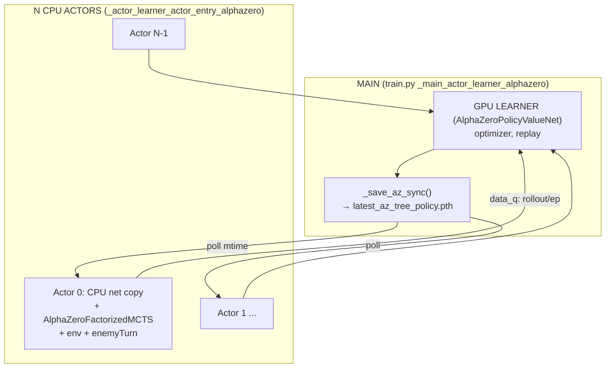
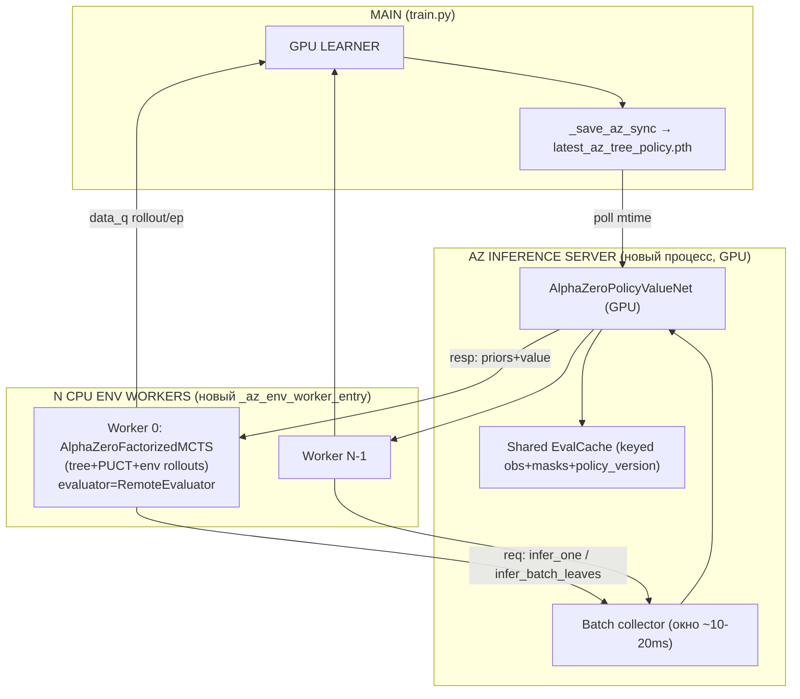
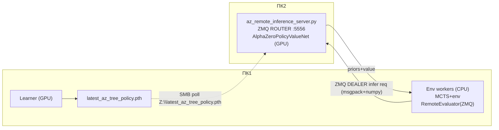

# План: Inference Server для AlphaZero TREE (local + LAN)

**Статус:** черновик дизайна (код не написан).
**Scope:** только `TRAIN_ALGO=alphazero_tree`. `alphazero_proxy` — Phase 2+ (кратко в §2).
**Эталон-паттерны (не копировать «как есть»):** GMZ variant B (`docs/inference-server-gmz-design.md`, `docs/remote-inference-server-gmz.md`).

> Все имена функций/файлов ниже сверены с кодом на ветке `main` (коммит 788d2b78). Где утверждается поведение — указан файл и строки.

---

## 1. Executive Summary

**Цель.** Вынести вызовы сети (`net.infer`) из N CPU-акторов AlphaZero tree в один централизованный GPU inference server (local) и опционально на отдельный ПК2 (LAN), сохранив семантику MCTS.

**Ключевой честный вывод (важно прочитать до планирования работ).**
В отличие от GMZ, у AlphaZero **tree** сеть — НЕ узкое место. Узкое место — это **реальные env-rollout'ы на CPU**: `env.step` + `env_u.enemyTurn(...)` на листьях (`alphazero_mcts.py:336-414`, `:645-758`). GPU при AZ-tree training практически простаивает (работает только learner). Поэтому ожидаемый выигрыш inference-server для AZ tree **скромнее, чем у GMZ**, и достигается двумя эффектами:

1. **Batching net-вызовов между потоками и воркерами.** Сейчас каждый актор зовёт `net.infer` на CPU по одному obs (`_evaluate_net`, `alphazero_mcts.py:214-224`). Централизация на GPU + сбор запросов в окно даёт большие батчи → меньшая суммарная стоимость инференса и разгрузка CPU-акторов от torch.
2. **Одна копия сети на GPU вместо N CPU-копий** (сейчас каждый актор грузит свою CPU-сеть, `train.py:8014-8016`), плюс акторы перестают конкурировать за CPU с torch-инференсом и могут отдать ядра под env-rollout'ы.

**Чего НЕ ждать.** Кратного роста ep/h «как у GMZ». Если хотим реального ускорения AZ tree — параллелить env-rollout'ы (`parallel_simulations`, `EnvClonePool`) и/или сокращать `enemyTurn`, а это вне scope inference-server.

**Сравнение с текущим «N CPU actors с локальной сетью».**

| | Сейчас (`_actor_learner_actor_entry_alphazero`) | To-Be (inference server) |
|---|---|---|
| Сеть | N CPU-копий, infer на CPU по 1 obs | 1 GPU-копия, batched infer |
| Env-rollout | На акторе (CPU) | **Остаётся на воркере (CPU)** |
| Tree/PUCT state | На акторе | **Остаётся на воркере** |
| GPU util | ~learner only | learner + батчи инференса |
| Риск | низкий (текущий код) | средний (новый IPC + round-trips) |

**Главные риски (top-3 в конце документа):** round-trip overhead на single-obs intermediate-evals; LAN-латентность при `max_depth>1`; когерентность eval-cache при смене весов.

---

## 2. Scope & Non-goals

**In scope:**
- `alphazero_tree` (PUCT + env rollouts), local + LAN.
- Совместимость с honest DET-eval (`_run_az_honest_eval`, `train.py:1705`; `_az_build_actor_det_payload`, вызывается на learner — НЕ на воркере, остаётся как есть).
- Совместимость с actor sync (`latest_az_{tree|proxy}_policy.pth`, см. §2.1) и resume checkpoint (`_load_checkpoint_payload`, `train.py:8288`).
- Feature flag + fallback на текущие CPU-акторы.

**Non-goals:**
- `alphazero_proxy` — заметка: proxy (`_run_proxy`, `alphazero_mcts.py:311-334`) — это **чистый net.infer без env**, поэтому он переносится на server тривиально (как GMZ). Его стоит добавить Phase 2+, переиспользуя тот же evaluator-сервер.
- Full remote MCTS (env на сервере) — отклонено (см. §"Ключевой вопрос").
- Reanalyze/learner — не меняем.

**Найдено / не найдено:**
- ✅ `AZ_MCTS_BATCH_EVAL_SIZE`, `AZ_MCTS_PARALLEL_SIMS`, `AZ_NUM_ACTORS`, `ACTOR_DET_EVAL_ENABLED`, `ACTOR_SYNC_ENABLED` существуют (`train.py:2938-2939, 2877, 350, 8050`).

### 2.1. ⚠️ P0-баг текущего кода: рассинхрон sync-path learner↔actor

Обнаружен **существующий баг** (не связан с inference-server, но блокирует его и портит текущую тренировку):

- **Learner пишет** `actor_sync/latest_az_{tree|proxy}_policy.pth` — тег зависит от `TRAIN_ALGO` (`train.py:8376-8378`: `_az_sync_tag = "tree" if TRAIN_ALGO == "alphazero_tree" else "proxy"`). Для `alphazero_tree` → `latest_az_tree_policy.pth`. Также пишется `latest_az_{tag}_opponent.pth` (`:8378`).
- **Актор читает** хардкод `actor_sync/latest_az_policy.pth` (`train.py:8051`, без тега).

Файлы **не совпадают** → в акторе `os.path.isfile(sync_path)` = False → `ACTOR_SYNC` молча no-op (`train.py:8077-8091`), актор всю тренировку сидит на стартовых весах. Без ошибки/варнинга. Касается и tree, и proxy.

**P0-fix (до/в рамках Phase 0):** выровнять путь в акторе на `latest_az_{tree|proxy}_policy.pth` (тот же `_az_sync_tag`), и использовать этот же путь как `sync_path` для inference-server (§6.3) и SMB (§7.3). Иначе и B-local, и B-remote унаследуют тот же мёртвый sync.

---

## 3. As-Is vs To-Be

### 3.1. As-Is (текущий AZ actor-learner)



### 3.2. To-Be Local (variant B-local)



### 3.3. To-Be LAN (ПК1 / ПК2)



---

## 4. API & Protocol Design

Сериализация — **msgpack + numpy bytes**, как у GMZ (`gmz_inference_protocol.py:14-29`, `_encode_array`/`_decode_array`). Эти хелперы общие и переиспользуемы; **но request/response поля у AZ другие** (GMZ возвращает результат search'а: `selected_actions`, `policy_targets`, `behavior_logits` — у AZ сервер возвращает «сырые» priors+value, search остаётся на воркере). Поэтому нужен **новый** `core/models/az_inference_protocol.py` (можно импортировать `_encode_value`/`_decode_value` из GMZ или продублировать, чтобы не вводить cross-deps).

### 4.1. Типы запросов

| kind | Назначение | payload | response |
|------|-----------|---------|----------|
| `infer_one` | root prior+value, либо intermediate-eval внутри rollout | `obs` (1×obs_dim), `legal_masks_by_head` | `priors` (list per head), `value` (float) |
| `infer_batch_leaves` | батч листовых позиций (`_evaluate_value_batch`) | `obs` (B×obs_dim), `legal_masks_by_head` (B per head), `count` | `values` (B floats), опц. `priors_batch` |
| `health_check` | GUI / pre-train | `auth_token`, `protocol_version` | `status`, `policy_version`, `gpu_name`, `queue_depth`, `uptime_s` |
| `policy_version` | дешёвый запрос версии весов | — | `policy_version` |
| (error) | сервер→воркер | — | `kind="error"`, `message` (RU) |
| (backpressure) | сервер→воркер при переполнении | — | `kind="backpressure"`, `wait_ms` |

> Примечание: `infer_one` и `infer_batch_leaves` можно унифицировать в один `infer` с `obs` всегда формы `B×obs_dim` (B=1 для root/intermediate). **Рекомендуется унификация** — упрощает батчер: сервер просто конкатенирует все входящие obs (из разных воркеров/потоков) в один GPU-forward. См. §5.

### 4.2. Поля request (унифицированный `infer`)

| Поле | Тип | dtype/shape | Заметка |
|------|-----|-------------|---------|
| `kind` | str | — | `"infer"` |
| `protocol_version` | int | — | `AZ_PROTOCOL_VERSION = 1` |
| `auth_token` | str | — | LAN; пусто = выкл |
| `worker_id` | int | — | = `actor_idx`; маршрут ответа (local: `reply_queues[worker_id]`) |
| `request_id` | int | — | монотонный per-worker; корреляция запрос↔ответ |
| `episode_id` | int | — | для логов/диагностики (tree state живёт на воркере!) |
| `move_id` | int | — | номер хода |
| `obs` | ndarray | `float32 [B, obs_dim]` | B≥1 |
| `legal_masks_by_head` | list[ndarray] | per head: `bool [B, head_size]` | **критично:** factorized, по головам (см. `n_actions`/`action_sizes`) |
| `want_priors` | bool | — | leaves-only можно вернуть лишь `values` (экономия трафика) |

### 4.3. Поля response

| Поле | Тип | shape | Заметка |
|------|-----|-------|---------|
| `kind` | str | — | `"infer_response"` |
| `worker_id`, `request_id` | int | — | эхо для корреляции |
| `priors` | list[ndarray] | per head: `float32 [B, head_size]` | masked-softmax уже применён (`net.infer`) |
| `value` | ndarray | `float32 [B]` | tanh ∈ [-1,1] |
| `policy_version` | int | — | версия весов сервера на момент forward |

### 4.4. Версионирование, auth, idempotency

- `protocol_version` — отдельный от GMZ счётчик (`AZ_PROTOCOL_VERSION`); mismatch → `error` с RU-текстом «Несовпадение версии протокола (ожидалось X, получено Y). Где: az_remote_inference_server. Что делать: одинаковый код на ПК1/ПК2».
- `auth_token` — как GMZ (`gmz_remote_inference_server._check_auth`, tools:188-194).
- **Idempotency/correlation:** local-режим использует per-worker `reply_queues[worker_id]` (как GMZ, design §3.1) — `request_id` нужен только для диагностики. Remote-режим: DEALER identity = `worker_id`, ROUTER отвечает по identity (как GMZ transport:50-99); `request_id` защищает от рассинхрона при retry.

---

## 5. Где живёт MCTS logic

### 5.1. Что выносится, что остаётся

**Остаётся на воркере (НЕ трогаем семантику):** весь `_run_tree` (`alphazero_mcts.py:515-781`) — PUCT (`_select_child_puct`), Dirichlet (`_apply_root_dirichlet`), progressive widening (`progressive_widening_allowed`), parallel sims + `EnvClonePool` (`:557-643`), env rollout (`_run_one_sim_on_clone`), backprop, `_final_policy_from_visits`.

**Выносится на server:** только два метода-эвалуатора:
- `_evaluate_net(obs, legal_masks)` → `(priors, value)` (`:214-224`) — root + intermediate.
- `_evaluate_value_batch(leaves)` → `[values]` (`:226-277`) — batched leaf eval.

### 5.2. Рефактор: инъекция evaluator

Ввести интерфейс-эвалуатор и передавать его в `AlphaZeroFactorizedMCTS`:

```text
class Evaluator(Protocol):
    def evaluate_one(obs, legal_masks_by_head) -> (priors, value)
    def evaluate_batch(leaves: list[{obs, legal_masks}]) -> list[value]   # + priors при нужде

LocalNetEvaluator   # текущее поведение: self.net.infer на CPU/GPU + EvalCache  (вариант A)
RemoteEvaluator     # шлёт infer-запросы через transport (local mp.Queue / remote ZMQ)
```

В `AlphaZeroFactorizedMCTS.__init__` — принимать `evaluator=None`; если задан, `_evaluate_net`/`_evaluate_value_batch` делегируют ему. Если `None` — текущий код (zero-diff fallback). Это сохраняет **один** код tree-поиска для вариантов A и B (как рекомендация GMZ design §5.4 «не копировать цикл»).

### 5.3. Семантика, которую обязаны сохранить

| Элемент | Где сейчас | После рефактора |
|---------|-----------|-----------------|
| Dirichlet на root | `_run_tree:532-534` | на воркере (priors применяются после `evaluate_one`) — **без изменений** |
| Progressive widening | `:574, :652` | на воркере |
| parallel sims + EnvClonePool | `:557-643` | на воркере; intermediate `evaluate_one` зовётся из ≤`parallel_sims` потоков → **зафиксированная стратегия:** один `RemoteEvaluator` на воркер с `threading.Lock` вокруг `send/recv` (request_id для корреляции). Per-thread transport/demux — отложено (over-engineering для MVP). |
| EvalCache | per-MCTS (`alphazero_mcts.py:199`) | **выбор:** (a) оставить L1-кэш на воркере + L2 на сервере, либо (b) только server-side. Рекомендация: **server-side кэш**, keyed `obs+masks+policy_version`, плюс маленький worker-side L1 на текущий ход (cache hits внутри одного хода — частые из-за повторяющихся листьев). |

### 5.4. Round-trip анализ (типовые `mcts_simulations=32`, `batch_eval_size=16`, `parallel_sims=8`, `max_depth=2`)

Считаем net-вызовы на **один ход** одного воркера (из `_run_tree`):

| Вызов | Кол-во | Батчуется? |
|-------|--------|-----------|
| root `_evaluate_net` | 1 | нет (B=1), но co-batch между воркерами на сервере |
| intermediate `_evaluate_net` (depth 0, т.к. `depth < max_depth-1`, `:701`) | ~32 (по 1 на sim) | по 1 obs; в parallel-пути идут из ≤8 потоков одновременно → **сервер батчит concurrent-запросы в окне** |
| leaf `_evaluate_value_batch` | 1 запрос на ~32 листа (parallel: один `_evaluate_value_batch`, `:626`; sequential: `ceil(32/16)=2`) | **да** |

**Итого round-trip'ов/ход/воркер:** ~`1 + 32 + 1 = 34` (parallel) или `1 + 32 + 2 = 35` (sequential).
**Это много** — и почти все из них single-obs intermediate. Выводы:

- **`max_depth=1` убирает intermediate-evals полностью** → `1 root + ceil(sims/batch)=2 leaf = 3` round-trip/ход. Для LAN это критично. (Текущий default `mcts_max_depth=2` в hyperparams.)
- В **parallel-пути** intermediate-evals идут из ≤`parallel_sims` потоков почти одновременно → серверный батчер их склеивает; при N воркерах сервер видит до `N×parallel_sims` concurrent single-obs → большие GPU-батчи. Это и есть throughput-аргумент.
- **Рекомендация по конфигу для remote:** `max_depth=1` (или 2 максимум) + `parallel_sims≥4`, чтобы intermediate-evals были concurrent, а не серийными в одном потоке.

> **Почему нельзя «отложить intermediate evals в один infer» на воркере (data-dependency).** Внутри одной симуляции intermediate-eval на depth 0 даёт `next_priors`, от которых зависит `next_action` следующего шага того же rollout (`alphazero_mcts.py:701-714`). Отложить и продолжить rollout нельзя — следующего шага без результата предыдущего не существует. Батчить можно только intermediate-evals **одной глубины из разных параллельных sims** — но это ровно то, что и так делает серверный батчер (concurrent-запросы в окне). Worker-side defer потребовал бы барьер-синхронизации между потоками `EnvClonePool` и почти не даёт выигрыша сверх server-side. Реальный рычаг сокращения round-trip'ов — `max_depth=1` (intermediate исчезают полностью), а не worker-side буфер.

### 5.5. Parity-тесты

- Существующий `tests/engine/test_alphazero_mcts_tree_basic.py::test_batch_eval_size_matches_sequential` — должен остаться зелёным после рефактора (LocalNetEvaluator = текущее поведение).
- Новые: `evaluate_one`/`evaluate_batch` parity между `LocalNetEvaluator` и `RemoteEvaluator` (через localhost-сервер) на фиксированных весах и obs.

---

## 6. Local Inference Server (variant B-local)

### 6.1. Новые процессы/очереди (по аналогии GMZ `train.py:9563-9583`)

- `request_q = ctx.Queue(maxsize=AZ_INFERENCE_REQUEST_QUEUE_MAX)`.
- `reply_queues = [ctx.Queue(maxsize=8) for _ in range(num_env_workers)]` — per-worker (надёжнее на Windows spawn, см. GMZ design §3.1).
- `inf_proc = ctx.Process(target=az_inference_server_entry, ...)` (spawn-совместимый top-level entry, как `gmz_inference_server_entry`, server:257).
- N воркеров `_az_env_worker_entry` (новый, по образцу `_gmz_env_worker_entry`, `train.py:8777`) с `RemoteEvaluator(LocalInferenceTransport(request_q, reply_queues[i]))`.

### 6.2. Env vars / hyperparams keys (префикс `AZ_`, НЕ `GMZ_`)

| Ключ hyperparams (`alphazero_tree`) | Env var | Default |
|---|---|---|
| `inference_server_enabled` | `AZ_INFERENCE_SERVER` | 0 |
| `inference_server_mode` | `AZ_INFERENCE_SERVER_MODE` | `local` |
| `num_env_workers` | `AZ_NUM_ENV_WORKERS` | = `num_actors` (8) |
| `inference_batch_size` | `AZ_INFERENCE_BATCH_SIZE` | 32 (≥ N×parallel_sims) |
| `inference_batch_interval_ms` | `AZ_INFERENCE_BATCH_INTERVAL_MS` | 10 |
| `inference_timeout` | `AZ_INFERENCE_TIMEOUT` | 5.0 |
| `inference_server_compile` | `AZ_INFERENCE_SERVER_COMPILE` | 1 |
| `inference_remote_host/port/auth` | `AZ_INFERENCE_REMOTE_HOST/PORT/AUTH_TOKEN` | `127.0.0.1`/**5556**/`""` |

### 6.3. Weight sync

- Сервер polling'ом читает `actor_sync/latest_az_{tree|proxy}_policy.pth` (тот же путь, что пишет `_save_az_sync`, `train.py:8377`, после P0-fix §2.1 — единый для learner/actor/server/SMB), интервал `AZ_INFERENCE_SYNC_INTERVAL=0.5s` — точь-в-точь как GMZ `_poll_weights` (server:107-135).
- `policy_version` берётся из payload (`train.py:8384`).
- **Stale handling:** так как tree state живёт на воркере, на сервере чистить нечего; при смене версии — **инвалидировать server-side EvalCache** (или версионировать ключ кэша через `policy_version`, что предпочтительнее — не теряем cross-move hits аккуратно). Воркер кладёт текущую `policy_version` (из ответа сервера) в rollout dict (как сейчас `current_policy_version`, `train.py:8130`).

### 6.4. Batching policy

- Сбор до `inference_batch_size` запросов за `inference_batch_interval_ms` (как `_collect_and_process_batch`, server:141-159).
- **Cross-worker fairness:** запросы из общей `request_q` обрабатываются FIFO; ответы маршрутизируются по `worker_id`. Конкатенация разных obs в один forward (B-измерение) — естественно, т.к. AZ-сервер stateless (нет per-env tree, в отличие от GMZ `run_batched_stateful`). **Это проще GMZ.**

### 6.5. Взаимодействие с learner GPU (contention)

- Server и learner — разные процессы, оверлап на уровне OS GPU scheduler (как GMZ design §7.2). Server делает `torch.cuda.set_device(0)` (как server:274) и работает только в `torch.no_grad()`.
- AZ-инференс лёгкий (priors+value, без recurrent), VRAM-footprint мал → contention с learner незначителен. Опц. отдельный `torch.cuda.Stream` для инференса (как server:78-80).

### 6.6. Feature flag + fallback

- `inference_server_enabled=0` (default) → текущий `_actor_learner_actor_entry_alphazero` без изменений.
- При `=1` и отсутствии CUDA → лог `[AZ][CONFIG][FALLBACK]` (RU) и откат на вариант A (как GMZ `GMZ_INFERENCE_SERVER_USING_FALLBACK`, `train.py:3091-3094`).

---

## 7. LAN Remote Inference Server (variant B-remote)

### 7.1. `tools/az_remote_inference_server.py` (новый)

**Reuse из GMZ:** структура `tools/gmz_remote_inference_server.py` (ZMQ ROUTER, `_collect_batch`, `_dispatch_incoming`, `_router_send/_recv`, health_check, argparse, RU-логи, `GpuBackend` для health) — переносится почти 1:1.

**Нельзя reuse:** ядро инференса. GMZ обёртка зовёт `GMZInferenceServer.build_batch_responses` → `BatchedGumbelMuZeroSearch.run_batched_stateful` (server:210) — это **полный model-based search** на сервере. У AZ сервер делает **только** `net.infer` на батче obs. Поэтому ядро — новый `AZInferenceEngine.evaluate_batch(obs_batch, masks_batch) -> (priors, values)` (общий с local entry).

**Несовместимости GMZ-сервера с AZ (список):**
1. Модель: `GumbelMuZeroNet` ≠ `AlphaZeroPolicyValueNet` (разные конструкторы, `alphazero_model.py:96` vs gmz).
2. Search: GMZ держит per-env tree state на сервере; AZ tree+env живут на воркере — сервер stateless.
3. Env: GMZ не нужен env на сервере; AZ env тоже не на сервере (✔ совпало) — но AZ **нуждается** в env на воркере, значит «full remote MCTS» исключён.
4. Протокол: GMZ response = результат search; AZ response = priors+value (§4).

### 7.2. Порт

GMZ занимает **5555**. AZ default — **5556** (env `AZ_INFERENCE_REMOTE_PORT`, отдельное firewall-правило). Чтобы можно было гонять оба сервера на одном ПК2.

### 7.3. SMB weights

ПК1 пишет `artifacts/models/actor_sync/latest_az_{tree|proxy}_policy.pth` (после P0-fix §2.1); ПК2 читает `Z:\latest_az_tree_policy.pth` (как GMZ §5 руководства). Нужен отдельный `search_cfg`-JSON для AZ (`obs_dim`, `action_sizes`, `hidden_size`, `num_layers`, `value_ensemble`, mcts params) — новый `tools/write_az_remote_search_cfg.bat` по образцу `write_gmz_remote_search_cfg.bat`.

**Opponent weights (self-play).** Learner также пишет `latest_az_{tag}_opponent.pth` (`train.py:8378`) для snapshot-оппонента. Оппонент исполняется **на воркере** (`build_policy_fn`, `train.py:8059`/`:8846`) и **не идёт через inference server** — значит по SMB на ПК2 его гнать не нужно. Если воркеру нужны свежие opponent-веса, он читает их локально на ПК1 (или из SMB-папки на ПК1). Документировать это в LAN-гайде, чтобы не путали с policy-весами.

### 7.4. Honest DET-eval НЕ идёт через inference server

`_run_az_honest_eval` (`train.py:1705`) гоняет полный MCTS **локально на learner-процессе** со своей копией сети (`_az_build_actor_det_payload`, `az_net`). При `inference_server_enabled=1` это поведение **сохраняется без изменений**: learner держит собственную `az_net` для eval, запросы на ПК2/local-IS не шлёт. Явно зафиксировано, чтобы никто не пытался «прокинуть eval через ПК2» (это сломало бы детерминизм honest-eval и добавило сетевую зависимость в gate).

### 7.5. Конфиг GUI на ПК1: `remote_is.json` vs новый файл

| Вариант | Pros | Cons |
|---|---|---|
| Расширить `remote_is.json` полем `algo`/`az` namespace | один файл, один код store | риск спутать GMZ/AZ настройки; миграция формата |
| **Новый `runtime/state/remote_is_az.json`** (рекоменд.) | чистая изоляция, переиспользуем `remote_is_store.py` логику (`normalize_remote_is`, `user_enabled_lan`) с новым path | дублирование ~30 строк store |

**Рекомендация:** новый `remote_is_az.json` + параметризовать `remote_is_store.py` (вынести path/ключ QSettings в аргумент, переиспользовать `normalize_remote_is`). Поля те же: `enabled`, `user_enabled_lan`, `host`, `port=5556`, `timeout`, `auth_token`, `weights_share_path`.

### 7.6. GUI (Qt PySide6)

- Панель в **Настройки → AlphaZero Tree** (по образцу `qml/components/GmzInferenceServerPanel.qml`): ползунки **Local** / **LAN**, host/port, кнопка «Проверить соединение» (зовёт `az_remote_health_check`, аналог transport:131).
- Дефолт (один ПК): Local on при CUDA, LAN off; LAN сохраняется только при явном `user_enabled_lan` (как GMZ store:24-32).

### 7.7. `tools/pc2_remote_az_is.bat` — нужен?

**Да** — по образцу `tools/pc2_remote_is.bat` (одна кнопка на ПК2: deps, firewall :5556, CUDA-check, запуск `az_remote_inference_server.py`). Конфиг `runtime/state/pc2_remote_az_is_config.bat`. Без него LAN-setup на ПК2 слишком ручной (AGENTS.md приоритет — GUI/одна кнопка).

### 7.8. Логи (AGENTS.md: RU, «что+где+что делать»)

| Маркер | Файл | Где |
|---|---|---|
| `[AZ][INF_SERVER]` | `LOGS_FOR_AGENTS_TRAIN.md` | local server в main-процессе |
| `[AZ][REMOTE_IS]` | `LOGS_FOR_AGENTS_REMOTE_IS.md` + `az_remote_is_<date>.log` | ПК2 |
| `[AZ][REMOTE_CLIENT]`, `[AZ][REMOTE_CLIENT][CONN]` | `LOGS_FOR_AGENTS_TRAIN.md` | воркеры на ПК1 |

---

## 8. Changes by File

| Файл | Изменение | Приоритет |
|------|-----------|-----------|
| `train.py` (§2.1 bugfix) | **Выровнять sync-path:** актор (`:8051`) читает `latest_az_{tree\|proxy}_policy.pth` вместо хардкода `latest_az_policy.pth` (совпасть с learner `:8377`). Самостоятельный fix, нужен и без IS | **P0** |
| `core/models/alphazero_mcts.py` | Инъекция `evaluator` в `AlphaZeroFactorizedMCTS`; `_evaluate_net`/`_evaluate_value_batch` делегируют при наличии; default = текущее поведение | **P0** |
| `core/models/az_inference_protocol.py` (нов.) | msgpack/numpy encode/decode, `AZ_PROTOCOL_VERSION`, builders `infer`/`health_check` | **P0** |
| `core/models/az_inference_transport.py` (нов.) | `LocalInferenceTransport` (mp.Queue) + `RemoteInferenceTransport` (ZMQ DEALER) + `az_remote_health_check` (можно обобщить GMZ transport, но AZ-протокол свой) | **P0** |
| `core/models/az_inference_server.py` (нов.) | `AZInferenceEngine.evaluate_batch`, batch collector, weight polling, server-side EvalCache, `az_inference_server_entry` (spawn top-level) | **P0** |
| `core/models/az_inference_client.py` (нов.) | `RemoteEvaluator`/`LocalNetEvaluator` (реализуют Evaluator) | **P0** |
| `train.py` | константы `AZ_INFERENCE_*` + flag/fallback; dispatch в `_main_actor_learner_alphazero`; новый `_az_env_worker_entry`; spawn server+workers; health_check для remote | **P0** |
| `tools/az_remote_inference_server.py` (нов.) | ZMQ ROUTER + `AZInferenceEngine` (reuse структуры GMZ tool) | **P1** |
| `tools/pc2_remote_az_is.bat` (нов.) + `runtime/state/pc2_remote_az_is_config.example.bat` | одна кнопка ПК2 | **P1** |
| `tools/write_az_remote_search_cfg.bat` (нов.) | генерация search_cfg для AZ | **P1** |
| `app/gui_qt/remote_is_store.py` | параметризовать path/QSettings-ключ; `remote_is_az.json` | **P1** |
| `app/gui_qt/qml/components/AzInferenceServerPanel.qml` (нов.) + `main.py`/settings wiring | панель AZ Local/LAN | **P1** |
| `app/gui_qt/az_hyperparams_defaults.py` | `inference_server_enabled`, `num_env_workers`, `inference_batch_size`, ... | **P0** |
| `hyperparams.json` (`alphazero_tree`) | новые ключи (default `inference_server_enabled=0`) | **P0** |
| `tests/engine/test_az_inference_protocol.py` (нов.) | encode/decode roundtrip | **P0** |
| `tests/engine/test_az_inference_server.py` (нов.) | localhost server integration (по образцу `test_gmz_remote_server.py`) | **P1** |
| `tests/engine/test_alphazero_mcts_tree_basic.py` | + parity Local vs Remote evaluator | **P1** |
| `docs/inference-server-az-design.md`, `docs/remote-inference-server-az.md`, `docs/pc2-remote-az-is-setup-guide.md` (нов.) | дизайн + LAN-гайд + AGENTS.md ссылка | **P2** |
| `AGENTS.md` | секция «Remote Inference Server (AZ)» | **P2** |

---

## 9. Phased Implementation

### Phase 0 — P0-fix sync + spike протокола + micro-benchmark gate
- **P0-fix (первым делом):** выровнять sync-path learner↔actor (§2.1) — актор должен читать `latest_az_{tree|proxy}_policy.pth`. Проверить, что после фикса актор реально перечитывает веса (лог mtime/version). Это самостоятельный bugfix, имеет ценность даже без inference-server.
- **Делаем:** `az_inference_protocol.py`, `az_inference_transport.py` (Local + Remote), skeleton `az_inference_server.py` (CPU, без compile), рефактор evaluator в MCTS (default-поведение не меняется).
- **Gate «стоит ли вообще» (до Phase 1 LAN-вложений):** micro-benchmark ep/h: вариант A (CPU actors, после sync-fix) **vs** 1 env worker + local GPU IS при `max_depth=1`. Если прирост `<10–15%` — B-remote/LAN почти наверняка не окупится (GPU не bottleneck, §1); решение с пользователем: останавливаться на B-local или сворачивать в пользу параллелизации env-rollout'ов.
- **Готово:** sync-fix подтверждён логом; unit-тест encode/decode зелёный; `test_batch_eval_size_matches_sequential` всё ещё зелёный; сервер на CPU стартует, отвечает на `infer`/`health_check` через localhost ZMQ; micro-benchmark прогнан, число задокументировано.
- **Smoke:** `python -c "from core.models.az_inference_transport import az_remote_health_check; print(az_remote_health_check(host='127.0.0.1', port=5556))"` (после ручного запуска CPU-сервера).
- **Лог-маркеры:** `[AZ][INF_SERVER] started device=cpu`, `[AZ][ACTOR] weight_sync version=N` (после fix).

### Phase 1 — local GPU server + 1 env worker smoke
- **Делаем:** `_az_env_worker_entry`, dispatch в `_main_actor_learner_alphazero` по `AZ_INFERENCE_SERVER`, spawn 1 server (GPU) + 1 worker; weight polling.
- **Готово:** 10+ эпизодов tree без ошибок; rollout dict валиден; learner обновляет веса; сервер их перечитывает (`weight_updated version=N`).
- **Smoke:** train с `AZ_INFERENCE_SERVER=1 AZ_NUM_ENV_WORKERS=1 AZ_MCTS_MAX_DEPTH=1`.
- **Маркеры:** `[AZ][INF_SERVER] batch=...`, `[AZ][ENV_WORKER] worker=0 started`, `[AZ][INF_SERVER] weight_updated`.

### Phase 2 — N workers + batching
- **Делаем:** N воркеров, batch collector + окно, server-side EvalCache (keyed policy_version), backpressure через `maxsize`.
- **Готово:** 6–8 воркеров стабильно; в логах видны батчи >1; ep/h и GPU-util **замерены** vs вариант A (не CI-gate).
- **Smoke:** train `AZ_INFERENCE_SERVER=1 AZ_NUM_ENV_WORKERS=8 AZ_MCTS_PARALLEL_SIMS=8`.
- **Маркеры:** `[AZ][INF_SERVER] batch=K inference_ms=...`.

### Phase 3 — LAN remote + SMB
- **Делаем:** `az_remote_inference_server.py`, `pc2_remote_az_is.bat`, `write_az_remote_search_cfg.bat`, health_check pre-train (как `train.py:9537-9559`), :5556.
- **Готово:** ПК2 слушает; ПК1 train через ZMQ; SMB-веса перечитываются; train падает корректно (RU-лог) если IS недоступен (как GMZ v1, руководство §9).
- **Smoke:** ПК2 `tools\pc2_remote_az_is.bat` → `[AZ][REMOTE_IS] listening on 0.0.0.0:5556`; ПК1 train с `AZ_INFERENCE_SERVER_MODE=remote`.
- **Маркеры:** `[AZ][REMOTE_IS] listening`, `[AZ][REMOTE_CLIENT][CONN]`, `[AZ][REMOTE_CLIENT] health_check ok`.

### Phase 4 — GUI + ops docs
- **Делаем:** `AzInferenceServerPanel.qml`, store `remote_is_az.json`, docs (design/LAN/pc2-guide), AGENTS.md.
- **Готово:** Local/LAN переключаются из GUI; «Проверить соединение» работает; гайды полны.

---

## 10. Testing Strategy

- **Unit:** `az_inference_protocol` encode/decode (включая factorized `legal_masks_by_head` разных dtype/shape); batch-parity MCTS (`evaluate_one`/`evaluate_batch` Local vs Remote дают идентичные priors/value на фикс. весах).
- **Integration:** localhost remote server (по образцу `tests/engine/test_gmz_remote_server.py`) — поднять сервер на CPU, прогнать `infer` батч, сверить с прямым `net.infer`.
- **Regression:** (1) honest DET-eval (`_run_az_honest_eval`) не задет — он на learner; (2) actor sync `latest_az_{tree|proxy}_policy.pth` обновляется и перечитывается (incl. P0-fix §2.1); (3) resume checkpoint восстанавливает policy_version/replay.
- **Perf:** requests/s и sims/s из логов батчей; p50/p95 latency per move (таймстемпы `request_id`); сравнить ep/h: вариант A vs B-local vs B-remote (ручной бенч, не CI). Замерить отдельно при `max_depth=1` и `max_depth=2` (round-trip разница, §5.4).

---

## 11. Risks & Mitigations

| Риск | Митигация |
|------|-----------|
| **Round-trip storm** на intermediate single-evals (32/ход) | `max_depth=1` по умолчанию для remote; `parallel_sims≥4` чтобы evals были concurrent и батчились сервером (§5.4) |
| **LAN-латентность × tree** | LAN рекомендован при `max_depth=1`; задокументировать ожидаемое замедление (как GMZ §9: −5–15%) |
| **Windows spawn pickling** | top-level entry-функции (`az_inference_server_entry`, `_az_env_worker_entry`); dict в очередях, не dataclass (GMZ design §3.1, client:500) |
| **ZMQ firewall** | `pc2_remote_az_is.bat` ставит правило на :5556; health_check pre-train с RU-ошибкой |
| **SMB stale weights** | polling mtime + `policy_version` в логах; max-staleness видна |
| **Eval cache coherency** при смене весов | server-side ключ кэша включает `policy_version` (инвалидируется естественно) |
| **Thread-safety RemoteEvaluator** в parallel-пути | **зафиксировано:** один `RemoteEvaluator`/воркер + `threading.Lock` вокруг send/recv + `request_id` для корреляции (per-thread transport отложен как over-engineering) |
| **GPU OOM** | AZ-инференс лёгкий; `inference_batch_size` ограничен; замерить до Phase 2 |
| **learner/IS contention** | разные процессы + `torch.no_grad()` + опц. отдельный stream |
| **Timeout storms** | retry 1–2 + RU-лог + (по умолчанию без CPU-fallback, как GMZ) |
| **Rollback** | `inference_server_enabled=0` → текущий код, поэтапная сборка P0→P4 |

---

## 12. Estimates (один разработчик, реалистично)

| Фаза | Дни |
|------|-----|
| Phase 0 (протокол + evaluator-рефактор + CPU server) | 2–3 |
| Phase 1 (local GPU + 1 worker) | 1.5–2 |
| Phase 2 (N workers + batching + кэш) | 2–3 |
| Phase 3 (LAN remote + SMB + bat) | 2–3 |
| Phase 4 (GUI + docs) | 2 |
| **Итого** | **~10–13 дней** (MVP local: Phase 0+1 ≈ 4–5) |

---

## 13. Open Questions (согласовать ДО кодинга)

1. **`max_depth` для remote.** Принять `max_depth=1` дефолтом при inference-server (резко снижает round-trips), или сохранить `=2` и терпеть латентность?
2. **EvalCache:** server-side (с версионированием) vs worker-L1+server-L2? (влияет на трафик и качество).
3. **Унификация `infer_one`/`infer_batch_leaves`** в один `infer` с B-осью — ок? (упрощает сервер).
4. **`remote_is_az.json` отдельным файлом** (рекоменд.) vs расширение `remote_is.json`?
5. **Решение по gate'у Phase 0:** если micro-benchmark покажет прирост `<10–15%` (GPU не bottleneck, §1) — останавливаемся на B-local, сворачиваем LAN, или переключаемся на параллелизацию env-rollout'ов (вне этого плана)? Нужен порог и решение заранее.
6. **`num_env_workers` default** = `num_actors` (8) или меньше (CPU-перегрузка при parallel_sims×workers потоков)?
7. **Proxy-режим** (`alphazero_proxy`) включаем в тот же сервер на Phase 2+ или отдельно?
8. **Порт 5556** ок, или другой диапазон?
9. **torch.compile** на AZ-сервере — нужен (на Windows triton часто нет, см. server:83-87)?
10. **Возвращать ли `priors` для leaf-батча** всегда (нужны для `EvalCache.set` приоров на воркере) или только `values` (экономия трафика, но кэш приоров на воркере не наполнится)?

---

## Recommended approach

**Вариант A/B-гибрид: net-only offload без tree/env на сервере.** Дерево PUCT, Dirichlet, progressive widening и env-rollout'ы (`enemyTurn`/`env.step`) остаются на CPU-воркере; на GPU-сервер уходят только `_evaluate_net` (root/intermediate) и `_evaluate_value_batch` (листья) через инъектируемый `Evaluator`. Это даёт stateless-сервер (проще GMZ, который держит per-env tree), один общий код tree-поиска для A и B, и cross-worker/cross-thread батчинг лёгких net-вызовов. Полный remote-MCTS (вариант C) отклонён: env неотделим от воркера без сериализации состояния и remote env-API. Критическое условие жизнеспособности (особенно LAN) — `max_depth=1` + `parallel_sims≥4`, иначе 32 single-obs intermediate-evals на ход превращаются в round-trip-шторм.

## Top 3 risks

1. **Round-trip overhead на intermediate single-evals** (до 32/ход при `max_depth=2`) — может съесть весь выигрыш, особенно по LAN. Митигация: `max_depth=1`, concurrent evals через `parallel_sims`, серверный батчер.
2. **Скромный потолок выигрыша:** при AZ tree GPU не bottleneck (узкое место — CPU env-rollout'ы), поэтому inference-server даёт меньше, чем у GMZ; есть риск, что усилия не окупятся без отдельной параллелизации env (open question #5).
3. **Когерентность eval-cache и thread-safety RemoteEvaluator** в parallel-пути (`EnvClonePool`, до `parallel_sims` потоков шлют запросы одновременно) — требует версионирования кэша по `policy_version` и аккуратной корреляции `request_id`/per-worker reply-очередей.
